# Nexo

**Adaptive, safe .NET features that run online or offline—no lock‑in.**

Nexo turns plain‑English requests into reusable .NET features (think LEGO‑style building blocks) you can drop into apps and CI/CD. Each feature is tested, scanned, signed, versioned, and easy to roll back. Use local models (Ollama) or cloud models (OpenAI/Azure)—swap providers later without rewrites.

⸻

## Why Nexo

- **Adaptive**: As your library of approved blocks grows, Nexo learns which ones work best and assembles them for you.
- **Safe**: Policy packs (tests, SAST/SCA, license checks), signing, RBAC, audit trail, and instant rollback.
- **Portable**: Run fully offline or online. Switch models/clouds/runtimes with flags—no vendor lock‑in.

⸻

## The building blocks (LEGO‑style)

Nexo composes small, reusable parts into a feature:
- **Sense** — notice context (e.g., driving, meeting, low battery)
- **Decide** — pick what to do (rules or on‑device AI)
- **Act** — do the thing (enable DND, auto‑reply, download maps)
- **Guard** — keep it safe (consent, quiet hours, approvals, audit)

Blocks live in a Feature Library (your team's shelf of approved pieces). You can hand‑write them or let Nexo help generate them via the Feature Factory—either way, they're checked and approved before use.

⸻

## Feature Factory (what it does)

One pipeline from prompt → production:
1. **Generate** a feature or block from plain English.
2. **Scan & test** (policy packs: unit tests, SAST/SCA, license checks).
3. **Sign & version** the artifact (DLL/NuGet) and record provenance.
4. **Publish** to the Feature Library with RBAC.
5. **Use & observe** in apps/CI; collect success/failure and overrides.
6. **Self‑heal**: propose a patch on failure, canary, then promote or rollback in seconds.

```
[ Prompt ] → [ Generate ] → [ Scan/Test ] → [ Sign/Version ] → [ Publish ] → [ Use/Observe ] → [ Patch/Canary/Rollback ]
```

⸻

## Modes (pick your comfort level)

- **Hand‑Build (deterministic)**: rules/code‑only; 100% reproducible.
- **Co‑Build (dev‑time AI)**: AI scaffolds code/tests; no AI at runtime.
- **Hybrid (optional AI)**: rules first; call AI only when available.
- **Self‑Healing (embedded AI)**: retries, failover, drift checks, auto‑patch proposals.

## Verification System

Nexo includes a comprehensive verification system that validates all product claims through automated testing:

- **Zero Platform Lock-in**: Cross-provider parity tests ensure semantic equivalence ≥ 85%
- **Offline ↔ Online Spectrum**: Mode-specific tests validate behavior and network isolation
- **Deterministic Outputs**: Hash-based assertions ensure consistent OFF mode outputs
- **Self-Healing Behavior**: Tests validate retry logic, failover, and circuit breaker behavior
- **Compounding Bricks**: Contract tests validate reusable component interfaces

### Quick Start

```bash
# Run all verification tests
nexo verify tests/specs

# Test specific mode
nexo verify tests/specs --mode off

# Test with Docker network isolation
docker run --rm --network none nexo-tests nexo verify tests/specs --mode off
```

See [Verification Documentation](docs/verification.md) for detailed usage and configuration.

## CLI Installation

Install the Nexo CLI as a .NET global tool:

```bash
# Install from local package
dotnet tool install --global Nexo.CLI --add-source ./nupkgs

# Verify installation
nexo --version
```

### Pipeline Run Command

Execute pipelines with the new `pipeline run` command:

```bash
# Execute a pipeline with a request file
nexo pipeline run --request ./examples/HelloWorld.yaml

# Execute with dry-run mode
nexo pipeline run --request ./examples/HelloWorld.yaml --dry-run

# Execute with custom output directory
nexo pipeline run --request ./examples/HelloWorld.yaml --out ./output

# Execute with maximum repair attempts
nexo pipeline run --request ./examples/HelloWorld.yaml --max-repairs 3

# Execute with stdin input
cat ./examples/HelloWorld.yaml | nexo pipeline run --stdin
```

The command supports both JSON and YAML request formats and generates both human-friendly and machine-readable reports.

## Architecture

```mermaid
flowchart LR
%% External Systems
    subgraph EXT["External Systems"]
        OpenAI["OpenAI API"]
        Ollama["Ollama Local"]
        Azure["Azure OpenAI"]
        Docker["Docker/Containers"]
        ExtUnity["Unity Engine"]
        Web["Web Platforms"]
        Mobile["Mobile Platforms"]
    end

    subgraph PRES["Presentation Layer"]
        CLI["Nexo.CLI"]
        WebUI["Web Interface"]
        Dashboard["Real-time Dashboard"]
        Interactive["Interactive CLI"]
    end

    subgraph FEA["Feature Modules"]
        AIFEAT["AI Features"]
        DEVFEAT["Development Features"]
        PLTFEAT["Platform Features"]
        SYSFEAT["System Features"]
    end

    subgraph APP["Application Layer"]
        CORE["Core Application"]
        AIS["AI Services"]
        PIPE["Pipeline Services"]
    end

    subgraph DOM["Domain Layer"]
        CDOM["Core Domain"]
        FDOM["Feature Domains"]
    end

    subgraph INFRA["Infrastructure Layer"]
        AIINF["AI Infrastructure"]
        PLTINF["Platform Infrastructure"]
        SYSINF["System Infrastructure"]
    end

    subgraph DATA["Data Layer"]
        FileSystem["File System"]
        Database["Database"]
        Cache["Cache Storage"]
        Config["Configuration Files"]
    end

    subgraph POLSYS["Policy System"]
        Safety["Safety Policies"]
        Quality["Quality Policies"]
        SecPol["Security Policies"]
        PolicyEng["Policy Engine"]
    end

    %% Invisible edges to spread columns
    OpenAI ~~~ Azure
    Azure ~~~ Docker
    Docker ~~~ ExtUnity
    ExtUnity ~~~ Web
    Web ~~~ Mobile

    CLI ~~~ WebUI
    WebUI ~~~ Dashboard
    Dashboard ~~~ Interactive

    AIFEAT ~~~ DEVFEAT
    DEVFEAT ~~~ PLTFEAT
    PLTFEAT ~~~ SYSFEAT

    CORE ~~~ AIS
    AIS ~~~ PIPE

    CDOM ~~~ FDOM

    AIINF ~~~ PLTINF
    PLTINF ~~~ SYSINF

    FileSystem ~~~ Database
    Database ~~~ Cache
    Cache ~~~ Config

    Safety ~~~ Quality
    Quality ~~~ SecPol
    SecPol ~~~ PolicyEng

%% Main left-to-right links (with lengthening for spacing)
    OpenAI --oCLI
    Ollama --oCLI
    Azure --oCLI
    Docker ------->PLTFEAT
    ExtUnity ------->PLTFEAT
    Web ------->PLTFEAT
    Mobile ------->PLTFEAT

    CLI ----->AIFEAT
    CLI ----->DEVFEAT
    CLI ----->SYSFEAT

    AIFEAT ----->AIS
    DEVFEAT ----->PIPE
    SYSFEAT ----->CORE

    CORE ----->CDOM
    AIS ----->FDOM
    PIPE ----->FDOM

    CDOM ----->AIINF
    FDOM ----->PLTINF

    AIINF ----->FileSystem
    PLTINF ----->Database
    SYSINF ----->Cache

    PolicyEng ---o Safety
    PolicyEng ---o Quality
    PolicyEng ---o SecPol
    PolicyEng ----->AIFEAT
    PolicyEng ----->DEVFEAT
    PolicyEng ----->SYSFEAT

%% Quick styling per layer for clarity
    classDef ext fill:#e1f5fe
    classDef pres fill:#f3e5f5
    classDef feat fill:#e8f5e8
    classDef appl fill:#fff3e0
    classDef dom fill:#fce4ec
    classDef infra fill:#f1f8e9
    classDef data fill:#e0f2f1
    classDef policy fill:#fff8e1

    class OpenAI,Ollama,Azure,Docker,ExtUnity,Web,Mobile ext
    class CLI,WebUI,Dashboard,Interactive pres
    class AIFEAT,DEVFEAT,PLTFEAT,SYSFEAT feat
    class CORE,AIS,PIPE appl
    class CDOM,FDOM dom
    class AIINF,PLTINF,SYSINF infra
    class FileSystem,Database,Cache,Config data
    class Safety,Quality,SecPol,PolicyEng policy
```



### Architecture Overview

This diagram illustrates the comprehensive architecture of the Nexo AI-powered code generation platform, organized into distinct layers following Clean Architecture principles:

#### Key Architectural Layers

1. **Presentation Layer**: CLI interfaces, web UI, and interactive dashboards
2. **Feature Modules**: Modular feature implementations (AI, Pipeline, Project, etc.)
3. **Application Layer**: Core business logic, use cases, and service orchestration
4. **Domain Layer**: Core business entities, value objects, and domain services
5. **Infrastructure Layer**: External service integrations and platform-specific implementations
6. **Data Layer**: File system, database, and configuration storage
7. **Policy System**: Cross-cutting safety, quality, and security policies

#### Key Features

- **AI-Powered Code Generation**: Multi-provider AI integration (OpenAI, Ollama, Azure)
- **Feature Factory**: Automated feature generation with Clean Architecture principles
- **Pipeline Orchestration**: Command-based pipeline execution and management
- **Multi-Platform Support**: Unity, Web, Mobile, and Desktop code generation
- **Agent Coordination**: Specialized AI agents for different development tasks
- **Policy-Driven Safety**: Comprehensive safety, quality, and security validation
- **Real-time Monitoring**: Performance monitoring and analytics
- **Plugin System**: Extensible architecture with hot-reloadable plugins

#### Data Flow

1. User interactions flow through the CLI/Web interface
2. Commands are processed by the appropriate feature modules
3. Business logic is handled in the application layer
4. Domain entities enforce business rules and constraints
5. Infrastructure services handle external integrations
6. Policies ensure safety and quality throughout the process
7. Results are generated and returned through the presentation layer

### Project Structure

```
Nexo/
├── src/                          # Source code
│   ├── Nexo.Core.Domain/         # Domain entities, value objects, interfaces
│   ├── Nexo.Core.Application/    # Application services and use cases
│   ├── Nexo.Infrastructure/      # Infrastructure implementations
│   ├── Nexo.CLI/                 # Command-line interface
│   └── Nexo.Feature.*/          # Feature modules (AI, Analysis, Pipeline, etc.)
├── tests/                        # Test projects
├── policies/                     # Safety and quality policies
│   ├── safety/                   # Safety rules and allowlists
│   ├── quality/                  # Quality gates and scoring
│   └── schemas/                  # JSON schema validation
├── docker/                       # Containerization files
├── scripts/                      # Build and deployment scripts
└── examples/                     # Configuration examples
```

⸻

## Quick start

These commands assume a CLI is available. If your setup differs, use `dotnet run` in the sample projects.

```bash
# Install (example)
dotnet tool install --global nexo

# Initialize a sample workspace
nexo init

# Run a scenario (provider‑agnostic)
NEXO_AI_MODE=off \
  nexo run examples/commute_guardian.yaml
```

### Swap backends without rewrites

```bash
# Local model (no data leaves machine)
NEXO_AI_MODE=hybrid NEXO_PROVIDER=local NEXO_MODEL=llama3 \
  nexo run examples/commute_guardian.yaml

# Cloud model (quality/scale)
NEXO_AI_MODE=embedded NEXO_PROVIDER=azure NEXO_MODEL=gpt-4o \
  nexo run examples/commute_guardian.yaml
```

### Minimal FeatureSpec (YAML)

```yaml
feature: commute_guardian
triggers:
  - uses: sense/activity
    expects: driving
  - uses: sense/bluetooth
    expects: "car_kit"
plan:
  - uses: reason/context_ranker
    require_ai: false
  - uses: guard/allowlist
    data: ["Phone", "Messages", "Maps"]
  - uses: act/set_focus
    data: { mode: "Driving" }
  - uses: act/announce_agenda
  - uses: act/autoreply_sms
    data: { template: "Driving—ETA {eta}." }
policies:
  offline_first: true
  driving_safe_ops_only: true
```

⸻

## Provider‑agnostic C# (tiny example)

```csharp
public interface IModelClient { Task<string> CompleteAsync(string prompt, CancellationToken ct); }
public sealed class OnlineClient : IModelClient { /* OpenAI/Azure */ }
public sealed class LocalClient  : IModelClient { /* Ollama/LLamaSharp */ }

public sealed class SmartClient : IModelClient
{
    private readonly IModelClient _primary, _fallback;
    public SmartClient(IModelClient primary, IModelClient fallback)
        => (_primary, _fallback) = (primary, fallback);

    public async Task<string> CompleteAsync(string prompt, CancellationToken ct)
    {
        try { return await _primary.CompleteAsync(prompt, ct); }
        catch { return await _fallback.CompleteAsync(prompt, ct); }
    }
}

public sealed class SummarizeFeature
{
    private readonly IModelClient _llm;
    public SummarizeFeature(IModelClient llm) => _llm = llm;
    public Task<string> RunAsync(string text, CancellationToken ct)
        => _llm.CompleteAsync($"Summarize:\n{text}", ct);
}
```

⸻

## Security, privacy, compliance

- **Offline‑first**: local models; cloud is opt‑in per scenario.
- **No data egress by default**.
- **Policy packs** enforce tests, SAST/SCA, license checks before publish.
- **Signed artifacts**, RBAC, audit log, deterministic rebuilds.

⸻

## Integrations

- **Azure DevOps**: drop approved features into pipelines; canary + rollback.
- **Visual Studio / VS Code**: generate/insert features during development.
- **GitHub Actions / GitLab CI**: use published artifacts via NuGet/DLL.

⸻

## Competitive snapshot (plain language)

- **Copilot / Codeium** — great suggestions in the editor, but not approved, reusable features for CI/CD.
- **Microsoft Semantic Kernel** — strong orchestration; governance is DIY.
- **LangChain / LlamaIndex / CrewAI** — powerful agents/RAG (mostly Python); less focus on .NET, signed features.
- **Backstage templates / dev templates** — standardize scaffolds, not generate/test/sign/publish small .NET features.
- **GPT‑Engineer** — one‑shot scaffolding, not a managed feature library.

**Nexo's wedge**: Signed, versioned .NET features with offline/online parity, policy gates, and instant rollback.

⸻

## Who it's for

Platform/DevOps teams in Microsoft‑centric, regulated orgs (defense, healthcare, finance, utilities) that need reusable internal tools, sometimes without any cloud AI.

⸻

## License

See LICENSE in this repo.

⸻

## Safety notes (mobile usage)

On iOS, runtime code download is prohibited. Nexo ships config/FeatureSpecs and pre‑approved primitives; new capabilities ship as signed app updates. On Android, prefer the same pattern; dynamic modules must follow store policy.