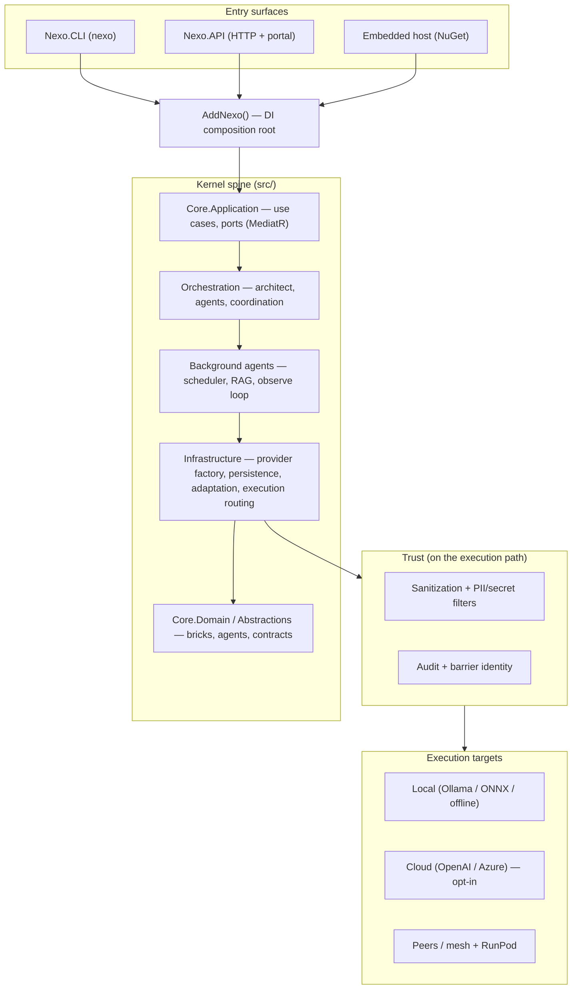

<p align="center">
  
</p>

# Nexo

[](https://github.com/IanFrelinger/Nexo/actions/workflows/kernel-gate.yml)
[](https://github.com/IanFrelinger/Nexo/actions/workflows/kernel-coverage-gate.yml)
[](LICENSE)
[](global.json)

> **Nexo is a local-first .NET AI runtime for running auditable AI workflows** — routing work across local, cloud, and peer execution targets, and extending its own capabilities under policy-controlled trust boundaries.

**New here? Start with one of three lanes:** [**Try**](#lane-1--try-run-the-portal) (run the portal in Docker) · [**Develop**](#lane-2--develop-dev-container--cli) (dev container + CLI) · [**Deploy**](#lane-3--deploy-operators) (GHCR images + compose).

It watches how teams build, test, release, and operate software; learns repeatable patterns; and improves automations over time — with built-in privacy controls such as pause/resume, local-first model routing, policy gates, and audit trails.

In this repo it ships as a .NET runtime plus deployable hosts and app-level configurations: kernel libraries, observe/adapt/improve loops, mesh/federation, gRPC transport, AWS ingress, `Nexo.CLI`, `Nexo.API`, four `apps/` configurations, and NuGet/GHCR/compose distribution paths.

Repository: <https://github.com/IanFrelinger/Nexo>

## Architecture at a glance



For layer-by-layer detail see [`docs/Architecture.md`](docs/Architecture.md); for the project/tier map see [`docs/ProjectTiers.md`](docs/ProjectTiers.md).

## Where to start

| Reader | Start here | First command or artifact |
|--------|------------|---------------------------|
| **Evaluator** | [Quick Start](#quick-start-5-minutes), then [`docs/GettingStarted.md`](docs/GettingStarted.md) | `dotnet run --project application/src/Nexo.CLI -- doctor --json` or the quickstart Docker image |
| **Contributor** | [`docs/ProjectTiers.md`](docs/ProjectTiers.md) — canonical repo map, then [`CONTRIBUTING.md`](CONTRIBUTING.md) | `dotnet build application/src/Nexo.CLI/Nexo.CLI.csproj --no-restore` |
| **Integrator** | [`docs/DistributionModels.md`](docs/DistributionModels.md), [`docs/sdk.md`](docs/sdk.md), [`docs/SdkIntegrationGuide.md`](docs/SdkIntegrationGuide.md) | NuGet host embed, `Nexo.Client`, HTTP API, CLI image, compose, or source integration |

## Scope in 30 seconds

- **Kernel:** observe → adapt → improve loops, component/brick contracts, policy, persistence, orchestration, runtime routing, background agents.
- **Trust:** data classification, sanitization before cloud calls, barrier identity resolution, local-first defaults, pause/resume controls, structured audit sinks.
- **Mesh:** peer discovery, capability advertisement, director/hub flows, trust-tier placement, virtual labs, and phase docs for federation.
- **Transport and ingress:** optional gRPC transport plus AWS SNS and DynamoDB ingress adapters.
- **Hosts:** `application/src/Nexo.CLI` (`nexo`) and `application/src/Nexo.API` (ASP.NET Core HTTP/portal host).
- **Apps:** `apps/game-director`, `apps/nexo-forge`, `apps/release-manager`, and `apps/runtime-studio` are application-level agent-set/configuration surfaces.
- **Distribution:** NuGet packages (`Nexo.Hosting`, bundles, SDK/client/lite/runtime packages), GHCR images, Dockerfiles, compose stacks, and source/monorepo integration.

For the canonical tier-by-tier project map, see [`docs/ProjectTiers.md`](docs/ProjectTiers.md). For distribution channels and their validation gates, see [`docs/DistributionModels.md`](docs/DistributionModels.md).

## What Nexo is not

- **Not a hosted SaaS or chatbot.** You run it (CLI, API, container, or embedded in your app); nothing is sent to a Nexo-operated service.
- **Not cloud-dependent.** Cloud providers are opt-in execution targets, not requirements. Air-gapped and local-only deployments are first-class.
- **Not a drop-in IDE plugin.** Nexo is a runtime and orchestration layer, not an editor extension.
- **Local-first by default.** Production network exposure requires auth + TLS; the shipped defaults are HTTP-only with no auth for local use (see the [Quick Start note](#quick-start-5-minutes)).

## Subsystem map

| Area | What it contains | Where to look |
|------|------------------|---------------|
| Kernel spine | Abstractions, core/domain/application, contracts, policies, infrastructure, orchestration, background agents, hosting | [`src/`](src/), [`docs/ProjectTiers.md`](docs/ProjectTiers.md) |
| Observe/adapt/improve | Pattern observation, analysis, adaptation, self-improvement, changelog, dogfood gates | [`docs/GapAnalysis.md`](docs/GapAnalysis.md), [`docs/DogfoodValidation.md`](docs/DogfoodValidation.md) |
| Mesh/federation | Mesh phases, virtual lab, friend mesh prefab, trust-tier placement, leases/checkpoints | [`docs/MeshPhase0NorthStar.md`](docs/MeshPhase0NorthStar.md), [`docs/MeshVirtualLab.md`](docs/MeshVirtualLab.md) |
| gRPC transport | Transport contracts, server, standalone host | `src/Nexo.Transport.Grpc*` |
| AWS ingress | SNS and DynamoDB adapters | `src/Nexo.Ingress.AwsSns`, `src/Nexo.Ingress.DynamoDb`, [`docs/MiddlewareIngress.md`](docs/MiddlewareIngress.md) |
| App surfaces | Game Director, Nexo Forge, Release Manager, Runtime Studio agent sets and operator scripts | [`apps/`](apps/), [`docs/GameDirectorStudio.md`](docs/GameDirectorStudio.md), [`apps/runtime-studio/README.md`](apps/runtime-studio/README.md) |
| Trust architecture | Barrier identity, data sensitivity, audit, policy packs, local-first controls | [`docs/TrustAndInformationArchitecture.md`](docs/TrustAndInformationArchitecture.md), [`docs/Architecture.md`](docs/Architecture.md) |
| Distribution | NuGet, HTTP/API, CLI image, compose, source, mesh/federation | [`docs/DistributionModels.md`](docs/DistributionModels.md), [`docs/RELEASE.md`](docs/RELEASE.md) |

## Default workflow

1. **Evaluate / develop** — [Quick Start](#quick-start-5-minutes) → **Lane 1 (Try)** or **Lane 2 (Develop)** for the portal, Dev Container, or CLI.
2. **Deploy / operate** — [Deploy (operators)](#deploy-operators) for GHCR images and compose stacks.
3. **Integrate** — [`docs/DistributionModels.md`](docs/DistributionModels.md) for NuGet, HTTP, CLI, compose, source, and mesh.
4. **Understand repo shape** — [`docs/ProjectTiers.md`](docs/ProjectTiers.md) for the canonical tier map.

## Why Nexo

**ChatGPT is a calculator; Nexo is an autopilot panel.** A calculator answers the prompt in front of it. An autopilot panel observes the whole flight, keeps the route visible, applies policy, hands control back to the operator, and records what happened.

- **Adaptive orchestration.** Nexo observes workflow signals, composes repeatable automations, and improves them under policy rather than treating every prompt as an isolated one-off.
- **Operator control.** Pause observation, keep execution local-first, route work by trust tier, and make every automation inspectable.
- **Data sovereignty.** Cloud providers are opt-in execution targets, not dependencies. Air-gapped and self-hosted deployments are first-class.
- **Traceability.** Decisions, routing, sanitization, adaptation, and promoted outputs are recorded for review.
- **Composable distribution.** Use the kernel via NuGet, run the CLI/API directly, deploy containers/compose, or federate trusted peers through mesh.

## Quick Start (5 minutes)

> ⚠️ **Not safe for public exposure as shipped.** Defaults are tuned for local dev: **HTTP-only, no authentication** (`ExposureProfile: Localhost`, `AuthorizationMode: None`, `AllowedHosts: "*"`). Before exposing Nexo to any network, configure **auth + TLS** — see [Security Defaults](#security-defaults).

Pick the lane that matches your goal. Most people should start with **Try**.

| Lane | Goal | You need |
|------|------|----------|
| [**1. Try**](#lane-1--try-run-the-portal) | See Nexo running in one command | Docker |
| [**2. Develop**](#lane-2--develop-dev-container--cli) | Build/extend the code, run the CLI | Docker + Dev Container (or native .NET SDK) |
| [**3. Deploy**](#lane-3--deploy-operators) | Run it as a service you operate | Docker + compose |

### Lane 1 — Try (run the portal)

The fastest way to see Nexo work. Uses the mock provider, so **no API keys are required**.

```bash
git clone https://github.com/IanFrelinger/Nexo.git && cd Nexo
docker build -f .docker/Dockerfile.quickstart -t nexo:quickstart .
docker run --rm -p 127.0.0.1:8080:8080 nexo:quickstart
# Open http://localhost:8080
```

The image has no auth; publish on all interfaces (`-p 8080:8080`) only behind auth + TLS — see [Security Defaults](#security-defaults) and `SECURITY.md`.

Prefer the CLI? Pull the published image and run a command:

```bash
docker pull ghcr.io/ianfrelinger/nexo-cli:latest
docker run --rm ghcr.io/ianfrelinger/nexo-cli:latest --help
```

### Lane 2 — Develop (dev container + CLI)

Recommended path uses the **Dev Container** (no host .NET SDK needed).

1. Install the [Dev Containers](https://marketplace.visualstudio.com/items?itemName=ms-vscode-remote.remote-containers) extension.
2. Open this repository.
3. Run **Dev Containers: Reopen in Container**.

From the integrated terminal:

```bash
dotnet build application/src/Nexo.CLI/Nexo.CLI.csproj --no-restore
dotnet run --project application/src/Nexo.CLI -- --help
dotnet run --project application/src/Nexo.CLI -- doctor --json
```

Run your first pipeline (create a template, validate it, run it):

```bash
tmp_dir="$(mktemp -d)"
template_path="$tmp_dir/nexo_pipeline_quickstart.json"
cat > "$template_path" <<'JSON'
{
  "templateId": "quickstart",
  "version": "1.0",
  "stages": [
    { "id": "ingest", "name": "Ingest", "mode": "Deterministic" },
    { "id": "hybrid", "name": "Hybrid", "mode": "Hybrid", "fallbackChain": ["Deterministic", "Agentic"] }
  ],
  "edges": [
    { "fromStageId": "ingest", "toStageId": "hybrid" }
  ]
}
JSON

dotnet run --project application/src/Nexo.CLI -- pipeline validate --template "$template_path"
dotnet run --project application/src/Nexo.CLI -- pipeline run --template "$template_path" --run-id quickstart-run --format-json
dotnet run --project application/src/Nexo.CLI -- pipeline diagnostics --format-json
```

<details>
<summary>Native SDK path (no Docker) and other escape hatches</summary>

Use this only when containers are not an option. Requires .NET SDK 9.x. The CLI and API target `net8.0` and roll forward onto the 9.x runtime (`RollForward=Major`, set in `Directory.Build.targets`), so an SDK-9-only machine works without a separate .NET 8 runtime.

```bash
git clone https://github.com/IanFrelinger/Nexo.git
cd Nexo
bash scripts/setup/setup.sh all
dotnet build application/src/Nexo.CLI/Nexo.CLI.csproj --no-restore
dotnet run --project application/src/Nexo.CLI -- doctor --json
```

Windows PowerShell:

```powershell
git clone https://github.com/IanFrelinger/Nexo.git
Set-Location Nexo
powershell -NoProfile -ExecutionPolicy Bypass -File .\scripts\setup\setup.ps1 -Mode all
dotnet build application/src/Nexo.CLI/Nexo.CLI.csproj --no-restore
dotnet run --project application/src/Nexo.CLI -- doctor --json
```

`setup … all` installs missing host tools and restores the build graph; it does **not** benchmark models. The optional Runtime Studio hardware tune (a multi-minute `nexo workflow optimize` run against local Ollama models) is opt-in: add `--tune` (`bash scripts/setup/setup.sh all --tune`) or `-Tune` (`setup.ps1 -Mode all -Tune`, needs Git Bash). Its output goes to the gitignored `.nexo/runtime-studio/agent_set.local.json`; the tracked `apps/runtime-studio/config/agent_set.local.json` is never modified by setup.

Other bootstrap helpers: `scripts/install/quickstart.sh`, `scripts/setup/setup-unix.sh`, `scripts/docker-restore.ps1`. Headless dev-container check: `pwsh -NoProfile -ExecutionPolicy Bypass -File ./scripts/Verify-DevContainer.ps1`.

`nexo validate` runs a broader architecture/test sweep and can be heavy on constrained hosts.
</details>

### Lane 3 — Deploy (operators)

Run Nexo as a service using compose stacks on a host you control. Review the [security warning](#quick-start-5-minutes) above first.

| File | Purpose |
|------|---------|
| `deploy/compose/docker-compose.portal.yml` | Director portal + `nexo-api` + Ollama. |
| `deploy/compose/docker-compose.agent-server.yml` | Portal + API + Ollama + mounted workspace + default Runtime Studio agent set. |
| `deploy/compose/docker-compose.game-director.yml` | Game Director sidecar and MCP-facing workflow. |
| `deploy/compose/docker-compose.ephemeral.yml` | Disposable local dependencies for tests and labs. |

```bash
docker compose -f deploy/compose/docker-compose.portal.yml up -d --build
docker compose -f deploy/compose/docker-compose.agent-server.yml up -d --build
# First boot: the bundled Ollama has no models until you pull one (tag must match OLLAMA_MODEL).
docker compose -f deploy/compose/docker-compose.portal.yml exec ollama ollama pull llama3.1:latest
```

Run these from the repo root. Stacks that bind-mount the repository (agent server, Game Director) default `NEXO_REPO_ROOT` to `../..` relative to `deploy/compose/` — the repo root — so no extra variables are needed; a `.env` for these stacks belongs in `deploy/compose/` (or pass `--env-file`), not the repo root.

Validate a pipeline template from a mounted workspace with the published CLI image:

```bash
docker run --rm -v "$PWD:/work" -w /work \
  ghcr.io/ianfrelinger/nexo-cli:latest \
  pipeline validate --template /work/path/to/template.json
```

For operator runbooks, images, and hardening, see [Deploy (operators)](#deploy-operators).

## Common CLI workflows

| Goal | Command |
|------|---------|
| Show all commands | `dotnet run --project application/src/Nexo.CLI -- --help` |
| Onboarding doctor | `dotnet run --project application/src/Nexo.CLI -- doctor --json` |
| Validate architecture/contracts | `dotnet run --project application/src/Nexo.CLI -- validate` |
| Analyze source/assemblies | `dotnet run --project application/src/Nexo.CLI -- analyze --path .` |
| Validate a pipeline | `dotnet run --project application/src/Nexo.CLI -- pipeline validate --template <file>` |
| Run a pipeline | `dotnet run --project application/src/Nexo.CLI -- pipeline run --template <file>` |
| Pipeline diagnostics | `dotnet run --project application/src/Nexo.CLI -- pipeline diagnostics --format-json` |
| Orchestrate a request | `dotnet run --project application/src/Nexo.CLI -- orchestrate "<request>"` |
| Interactive chat | `dotnet run --project application/src/Nexo.CLI -- chat` |
| Observe / adapt / improve | `dotnet run --project application/src/Nexo.CLI -- observe` / `adapt` / `improve` |
| Dogfood validation | `dotnet run --project application/src/Nexo.CLI -- dogfood all` |
| Trust dashboard | `dotnet run --project application/src/Nexo.CLI -- trust dashboard` |
| Apply a trust policy pack | `dotnet run --project application/src/Nexo.CLI -- trust pack apply --id strict-enterprise` |
| Background-agent daemon | `dotnet run --project application/src/Nexo.CLI -- background-agent daemon --duration 10m` |
| Runtime Studio status | `dotnet run --project application/src/Nexo.CLI -- runtime-studio status` |
| Mesh sync/capabilities | `dotnet run --project application/src/Nexo.CLI -- mesh sync` |
| gRPC/runtime execution | `dotnet run --project application/src/Nexo.CLI -- runtime execute --runtime-manifest <file>` |
| CI verification bundle | `dotnet run --project application/src/Nexo.CLI -- ci verify` |
| Release preflight | `dotnet run --project application/src/Nexo.CLI -- release preflight <semver>` |
| Trigger release workflow | `dotnet run --project application/src/Nexo.CLI -- release dispatch <semver> [--ref master]` |
| Metrics report | `dotnet run --project application/src/Nexo.CLI -- metrics report` |
| Config management | `dotnet run --project application/src/Nexo.CLI -- config show` |
| Docker management | `dotnet run --project application/src/Nexo.CLI -- docker build` / `run` / `clean` |
| Changelog generation | `dotnet run --project application/src/Nexo.CLI -- changelog` |
| Maintenance cleanup | `dotnet run --project application/src/Nexo.CLI -- maintenance clean` |

## Application surfaces

| App | What it is | First doc |
|-----|------------|-----------|
| `apps/game-director` | Self-hosted, MCP-exposed AI sidecar for game balance, map validation, and content generation. | [`apps/game-director/README.md`](apps/game-director/README.md) |
| `apps/nexo-forge` | Vertical agent-set configuration for adaptive multiplayer FPS prototyping. | [`apps/nexo-forge/README.md`](apps/nexo-forge/README.md) |
| `apps/release-manager` | Release-readiness automation agent set for repo monitoring, tests, SLO evidence, and reports. | [`apps/release-manager/README.md`](apps/release-manager/README.md) |
| `apps/runtime-studio` | Planner/worker Runtime Studio agent set and operator scripts hosted by CLI or API. | [`apps/runtime-studio/README.md`](apps/runtime-studio/README.md) |

## Deploy (operators)

Ship Nexo from published container images and compose files. Host-native scripts are escape hatches for development or constrained environments, not the default production path.

**Images**

| Image | Use |
|-------|-----|
| `ghcr.io/ianfrelinger/nexo-cli:latest` | Automation, agents, validation, release preflight, and mounted-workspace commands. |
| Build from `.docker/Dockerfile.quickstart` | Single-container API + portal smoke path with mock-friendly defaults. |
| Build from `.docker/Dockerfile.api` | API image used by compose stacks. |

**Compose**

```bash
# Director portal + API + Ollama
docker compose -f deploy/compose/docker-compose.portal.yml up -d --build

# Full agent-server stack with mounted workspace and Runtime Studio config
# (mounts the repo root by default; NEXO_REPO_ROOT only if you want another tree)
docker compose -f deploy/compose/docker-compose.agent-server.yml up -d --build
```

Operator runbooks and deployment references:

- [`docs/DEPLOYMENT.md`](docs/DEPLOYMENT.md)
- [`docs/SelfHostedAgentServer.md`](docs/SelfHostedAgentServer.md)
- [`apps/runtime-studio/README.md`](apps/runtime-studio/README.md)
- [`docs/ProductionReadinessGate-v1.md`](docs/ProductionReadinessGate-v1.md)
- [`docs/CiFirstHardwareSecond.md`](docs/CiFirstHardwareSecond.md)
- [`docs/RELEASE.md`](docs/RELEASE.md)

## Providers

Model routing is provider-based and local-first by default.

| Provider | Notes |
|----------|-------|
| `offline`, `mock`, `mock-json`, `echo` | Deterministic/local-friendly paths; mock paths require explicit opt-in where applicable. |
| `local` | In-process local model path. |
| `ollama` | Local Ollama runtime (`OLLAMA_BASE_URL`, `OLLAMA_MODEL`). |
| `openai` | Requires `OPENAI_API_KEY`; use trust/sanitization controls for sensitive workloads. |
| `azure` | Requires `AZURE_OPENAI_*` settings. |
| `video` | Video model service path where configured. |

See [`docs/Configuration.md`](docs/Configuration.md).

## Project layout

The canonical repo map is [`docs/ProjectTiers.md`](docs/ProjectTiers.md). Use it to understand which projects are kernel spine, deployable hosts, distribution packages, optional transport/mesh, product satellites, and tests.

```text
Nexo/
├── src/                          # kernel spine, runtime, distribution, optional transport/ingress, tests
├── application/src/              # CLI/API hosts, Game Director projects, app tests
├── apps/                         # runtime-studio, nexo-forge, game-director, release-manager configs
├── docs/                         # architecture, operations, mesh, release, SDK, samples, runbooks
├── config/                       # trust policy packs
├── scripts/                      # setup, install, CI, release helpers
├── tools/                        # sidecars and repo tools
├── .devcontainer/
├── .docker/
├── .github/
├── Nexo.sln                      # full repository solution
├── Nexo.Kernel.sln               # kernel-focused solution
├── Nexo.Runtime.sln              # runtime-focused solution
├── Nexo.Core.slnf                # Tier 0 + CLI/API hosts
├── Nexo.LocalDevCore.slnf        # fast local CLI + core test slice
└── Nexo.PrimeTime.slnf           # selected high-signal test projects
```

## Testing

For this repo, prefer focused validation first, then broaden only when the changed area requires it.

```bash
# CLI smoke
dotnet run --project application/src/Nexo.CLI -- --help

# focused pipeline tests
dotnet test src/Nexo.Tests.Infrastructure/Nexo.Tests.Infrastructure.csproj --filter "FullyQualifiedName~Pipelines"

# certification + generation safety gate (same filter as CI cert-gate workflow)
bash scripts/run-cert-gate.sh

# broader local CLI test runner path
dotnet run --project application/src/Nexo.CLI -- test local
```

Testing strategy and guard rails:

- [`docs/Testing.md`](docs/Testing.md)
- [`docs/architecture/TestingModel.md`](docs/architecture/TestingModel.md)
- [`docs/architecture/TestingStrategyPivot-v1.md`](docs/architecture/TestingStrategyPivot-v1.md)

## Documentation map

Start here:

- [`docs/DocsIndex.md`](docs/DocsIndex.md) — documentation hub.
- [`docs/ProjectTiers.md`](docs/ProjectTiers.md) — canonical repo/project tier map.
- [`docs/GettingStarted.md`](docs/GettingStarted.md) — guided first-hour setup and first pipeline.
- [`docs/DistributionModels.md`](docs/DistributionModels.md) — NuGet, HTTP, CLI, compose, source, mesh distribution channels.
- [`docs/Architecture.md`](docs/Architecture.md) — architecture and subsystem overview.
- [`docs/Conventions.md`](docs/Conventions.md) — current code conventions and migration honesty.
- [`docs/CiGateInventory.md`](docs/CiGateInventory.md) — CI workflow inventory and consolidation recommendations.
- [`docs/TrustAndInformationArchitecture.md`](docs/TrustAndInformationArchitecture.md) — trust model, barriers, audit, sensitivity.
- [`docs/Configuration.md`](docs/Configuration.md) — environment/config options.
- [`docs/ProductionReadinessGate-v1.md`](docs/ProductionReadinessGate-v1.md) — production gate procedure.
- [`docs/RELEASE.md`](docs/RELEASE.md) — NuGet + GHCR release hub.

## Security Defaults

Out of the box, Nexo runs on **HTTP only** with **no authentication** on API endpoints. This is intentional for local development — the default `ExposureProfile` is `Localhost`. Declaring `Lan`, `Tailnet` or `Public` without built-in auth makes the API **refuse to start** (escape hatch: `Nexo__Security__AllowUnauthenticatedNetworkExposure=true`), and the remote container-execution routes are unmapped unless `Nexo__Execution__ServeRemoteExecution=true` — see [`SECURITY.md`](SECURITY.md#default-posture-and-in-scope-surfaces).

For any network-exposed deployment:

```bash
# Set API key auth for mutating endpoints:
export Nexo__Security__AuthorizationMode=ApiKey
export Nexo__Security__ApiKey=your-secret-key
export Nexo__Security__AuthorizationScope=AllApi

# Or use bearer token:
export Nexo__Security__AuthorizationMode=BearerToken
export Nexo__Security__BearerToken=your-token
```

For HTTPS, configure `ASPNETCORE_URLS=https://+:8443` with a certificate, or place Nexo behind a reverse proxy such as nginx, Caddy, or Traefik.

See [`docs/Configuration.md`](docs/Configuration.md) for security options and [`docs/TailscaleAndNexo.md`](docs/TailscaleAndNexo.md) for Tailnet deployment.

## Barrier Identity Resolution Notes

- JWT barrier resolution reads pre-validated claims from host auth middleware.
- Barrier-identity API keys (the trust-path resolver's key registry) are stored as SHA-256 hashes, not plaintext. This does **not** describe `Nexo:Security:ApiKey`, which the built-in auth middleware compares in constant time against the configured plaintext value — keep it in the environment or a secret store, not in committed `appsettings.json`.
- Audit details never include full API key values.
- Trust policy packs (`strict-enterprise`, `internal-only`, `air-gapped`) can be listed, described, and applied through `nexo trust pack ...`.
- Observation can be paused and resumed through `nexo trust pause` / `nexo trust resume`.

## License

Nexo uses an open-core model: single-node, inspectable runtime/SDK/trust surfaces are Apache-2.0, while fleet-scale governance and vertical app packaging are commercial. See [LICENSE](LICENSE) for Apache-2.0 terms and [LICENSING.md](LICENSING.md) for the authoritative tier map and CI-enforced project boundary (`make dependency-boundary-gate`).
