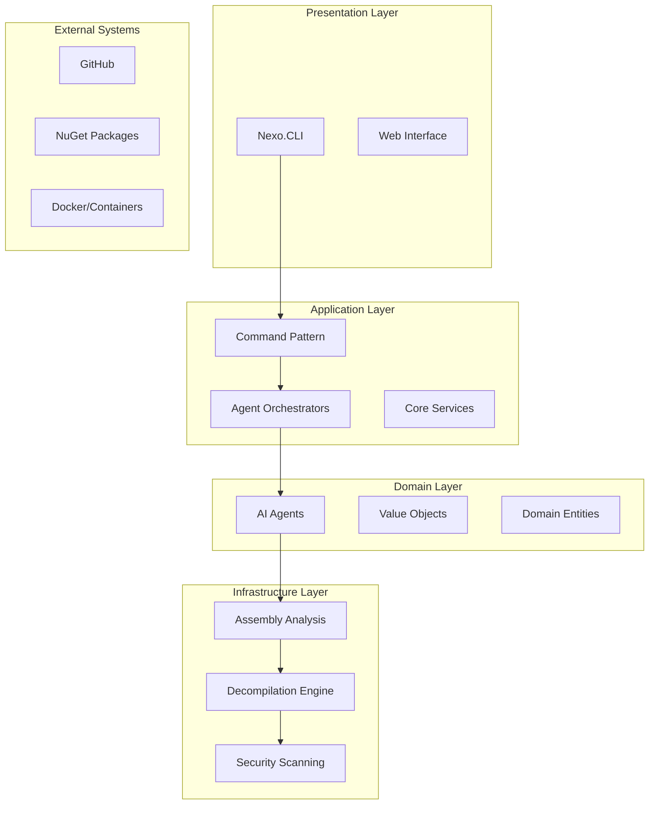

# Nexo

**Native AI Agent-First Framework for .NET Development with DLL Building and Decompilation Capabilities**

Nexo is a comprehensive AI-powered development framework that provides cross-platform agents, assembly analysis, and decompilation capabilities. Built with hexagonal architecture principles, it offers a complete solution for .NET development with native AI agent support.

⸻

## Why Nexo

- **Agent-First Architecture**: Cross-platform AI agents are treated as first-class citizens
- **DLL Building & Decompilation**: Comprehensive assembly analysis and source code recovery
- **Hexagonal Architecture**: Clean separation of concerns with ports and adapters
- **Cross-Platform**: Native support for Windows, macOS, Linux, Web, Mobile, Cloud, and Container platforms
- **Command Pattern**: Flexible orchestration with composable commands
- **Security-First**: Built-in security analysis and vulnerability scanning

⸻

## Core Capabilities

### 🤖 AI Agents
- **Cross-Platform Agents**: Native support across all major platforms
- **Code Generation Agent**: Specialized for code generation tasks
- **Security Analysis Agent**: Comprehensive security vulnerability scanning
- **Decompilation Agent**: Assembly analysis and decompilation capabilities
- **Agent Orchestration**: Coordinate multiple agents for complex workflows

### 🔧 Assembly Analysis & Decompilation
- **Assembly Metadata Extraction**: Complete assembly information and dependencies
- **Source Code Decompilation**: Convert DLLs back to readable source code
- **IL Analysis**: Intermediate Language code analysis and optimization
- **Security Scanning**: Vulnerability detection and threat analysis
- **Performance Analysis**: Assembly performance characteristics and bottlenecks
- **Dependency Analysis**: Complete dependency mapping and conflict detection

### 🏗️ Architecture Features
- **Hexagonal Architecture**: Clean separation between domain, application, and infrastructure
- **Command Pattern**: Composable commands with flexible orchestration
- **Value Objects**: Type-safe value objects replacing traditional enums
- **Agent Capabilities**: Extensible capability system for agent specialization
- **Cross-Platform Support**: Native execution across multiple platforms

⸻

## Quick Start

### Installation

```bash
# Clone the repository
git clone https://github.com/IanFrelinger/Nexo.git
cd Nexo

# Build the solution
dotnet build

# Run the CLI
dotnet run --project src/Nexo.CLI
```

### Basic Usage

```bash
# Show version information
nexo version

# Show help
nexo help

# Analyze an assembly
nexo assembly analyze --path MyAssembly.dll

# Decompile an assembly
nexo assembly decompile --path MyAssembly.dll --output ./decompiled

# Security scan
nexo assembly security-scan --path MyAssembly.dll
```

⸻

## Architecture



### Project Structure

```
Nexo/
├── src/
│   ├── Nexo.CLI/                    # Command-line interface
│   ├── Nexo.Core/                   # Core configuration and utilities
│   ├── Nexo.Core.Application/       # Application layer (commands, orchestrators)
│   ├── Nexo.Core.Domain/            # Domain layer (agents, entities, value objects)
│   └── Nexo.Shared/                 # Shared models and constants
├── scripts/                         # Build and utility scripts
└── README.md
```

⸻

## Agent Capabilities

### Core Agent Types

- **Code Generation Agent**: Generate code in various programming languages
- **Security Analysis Agent**: Analyze code and systems for security vulnerabilities
- **Decompilation Agent**: Analyze and decompile .NET assemblies
- **Cross-Platform Agent**: Base agent for cross-platform operations

### Agent Capabilities

- **Assembly Analysis**: Analyze .NET assemblies for metadata, dependencies, and structure
- **Assembly Decompilation**: Decompile .NET assemblies to source code and IL
- **IL Analysis**: Analyze Intermediate Language code for patterns and issues
- **Assembly Security Scanning**: Scan assemblies for security vulnerabilities and threats
- **Assembly Performance Analysis**: Analyze assembly performance characteristics
- **Code Generation**: Generate code in various programming languages
- **Natural Language Processing**: Process and understand human language
- **Cross-Platform Deployment**: Deploy applications across multiple platforms

⸻

## Assembly Analysis Features

### Metadata Extraction
- Assembly name, version, and location information
- Type definitions and member information
- Custom attributes and metadata
- Resource information and embedded files
- Dependency mapping and references

### Decompilation Capabilities
- Source code recovery from compiled assemblies
- IL code analysis and optimization
- Multiple output formats (C#, VB.NET, IL)
- Configurable decompilation settings
- Warning and error reporting

### Security Analysis
- Vulnerability scanning and threat detection
- Malware and obfuscation detection
- Code injection and privilege escalation analysis
- Data exfiltration detection
- Security policy compliance checking

⸻

## Database & API Support

### Database Connections
- **SQL Server**: Full Entity Framework Core support
- **PostgreSQL**: Npgsql integration
- **MySQL/MariaDB**: Cross-platform database support
- **SQLite**: Embedded database support
- **MongoDB**: Document database integration
- **Redis**: Caching and session storage
- **Cassandra**: NoSQL database support
- **Elasticsearch**: Search and analytics
- **InfluxDB**: Time-series data
- **Cosmos DB**: Azure cloud database
- **DynamoDB**: AWS cloud database

### API Endpoints
- **HTTP/HTTPS**: RESTful API support
- **WebSocket**: Real-time communication
- **gRPC**: High-performance RPC
- **FTP/SFTP**: File transfer protocols
- **SSH**: Secure shell connections
- **TCP/UDP**: Low-level network protocols

⸻

## Bootstrap Process

### Agent Initialization
```csharp
// Initialize an agent
var agent = new DecompilationAgent(
    AgentId.NewId(),
    new AgentName("Assembly Analyzer"),
    PlatformType.Windows
);

// Initialize with context
var context = new AgentContext(PlatformType.Windows);
var result = await agent.InitializeAsync(context);
```

### Application Startup
```csharp
// CLI Program.cs
var builder = Host.CreateApplicationBuilder(args);
builder.Services.AddLogging(configure => configure.AddConsole());
var host = builder.Build();

// Create and register agents
var agentOrchestrator = new AgentOrchestrator();
await agentOrchestrator.RegisterAgentAsync(agent);
```

⸻

## DLL Building & Decompilation

### Building DLLs
- **Multi-target Framework**: Support for .NET 8.0, .NET 6.0, .NET Standard 2.0
- **NuGet Package Generation**: Automatic package creation and publishing
- **CI/CD Integration**: GitHub Actions and Azure DevOps support
- **Code Analysis**: Built-in SAST/SCA scanning capabilities
- **Security Analysis**: Comprehensive security vulnerability detection

### Decompilation Features
- **ICSharpCode.Decompiler**: Advanced C# decompilation
- **Mono.Cecil**: Assembly metadata analysis
- **System.Reflection**: Runtime type information
- **Cross-Platform**: Windows, macOS, Linux support
- **Multiple Formats**: C#, VB.NET, IL output

⸻

## Configuration

### Environment Variables
```bash
# API Configuration
export NEXO_API_KEY="your-api-key"
export NEXO_DATABASE_CONNECTION_STRING="your-connection-string"
export NEXO_LOG_LEVEL="Information"
export NEXO_CACHE_SIZE="1000"
export NEXO_TIMEOUT="30000"
```

### Build Configuration
```xml
<!-- Directory.Build.props -->
<PropertyGroup>
  <TargetFramework>net8.0</TargetFramework>
  <EnableCodeGeneration>true</EnableCodeGeneration>
  <SupportMultiPlatformTargeting>true</SupportMultiPlatformTargeting>
  <GeneratePackageOnBuild>false</GeneratePackageOnBuild>
</PropertyGroup>
```

⸻

## Examples

### Assembly Analysis
```csharp
// Analyze an assembly
var command = new AnalyzeAssemblyCommand();
var input = new AnalyzeAssemblyInput 
{ 
    AssemblyPath = "MyAssembly.dll",
    IncludePrivateMembers = false,
    IncludeSecurityAnalysis = true
};
var result = await command.ExecuteAsync(input);
```

### Decompilation
```csharp
// Decompile an assembly
var command = new DecompileAssemblyCommand();
var input = new DecompileAssemblyInput 
{ 
    AssemblyPath = "MyAssembly.dll",
    Settings = new DecompilationSettings 
    { 
        IncludeComments = true,
        IncludeAttributes = true,
        Language = "C#"
    }
};
var result = await command.ExecuteAsync(input);
```

### Security Scanning
```csharp
// Security scan
var command = new ScanAssemblySecurityCommand();
var input = new ScanAssemblySecurityInput 
{ 
    AssemblyPath = "MyAssembly.dll",
    ScanOptions = new SecurityScanOptions 
    { 
        ScanForVulnerabilities = true,
        ScanForMalware = true,
        ScanForObfuscation = true
    }
};
var result = await command.ExecuteAsync(input);
```

⸻

## Development

### Building
```bash
# Build the solution
dotnet build

# Run tests
dotnet test

# Create NuGet packages
dotnet pack
```

### Contributing
1. Fork the repository
2. Create a feature branch
3. Make your changes
4. Add tests for new functionality
5. Follow conventional commit format (see below)
6. Submit a pull request

### Commit Convention
This project uses [Conventional Commits](https://www.conventionalcommits.org/) to maintain a clear and consistent commit history. All commits must follow this format:

```
<type>[optional scope]: <description>

[optional body]

[optional footer(s)]
```

#### Types
- `feat`: A new feature
- `fix`: A bug fix
- `docs`: Documentation only changes
- `style`: Changes that do not affect the meaning of the code
- `refactor`: A code change that neither fixes a bug nor adds a feature
- `perf`: A code change that improves performance
- `test`: Adding missing tests or correcting existing tests
- `build`: Changes that affect the build system or external dependencies
- `ci`: Changes to our CI configuration files and scripts
- `chore`: Other changes that don't modify src or test files
- `revert`: Reverts a previous commit

#### Examples
```bash
feat: add assembly decompilation capability
fix: resolve memory leak in agent orchestration
docs: update API documentation for security scanning
test: add integration tests for CLI commands
ci: add commitlint validation to GitHub Actions
```

The CI pipeline will validate all commit messages and fail if they don't follow the conventional commit format.

⸻

## License

MIT License - see LICENSE file for details.

⸻

## Support

- **Issues**: Report bugs and request features on GitHub Issues
- **Documentation**: Comprehensive documentation in the `/docs` directory
- **Examples**: Working examples in the `/examples` directory

⸻

## Roadmap

- [ ] Enhanced decompilation accuracy
- [ ] Additional security scanning capabilities
- [ ] Web-based assembly analysis interface
- [ ] Plugin system for custom analyzers
- [ ] Integration with popular IDEs
- [ ] Cloud-based analysis services