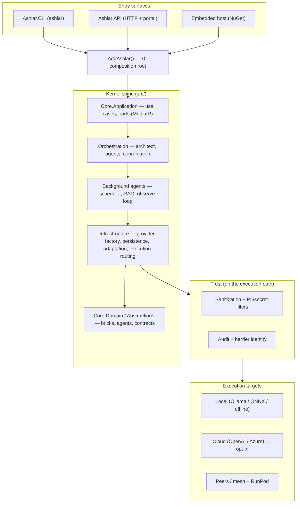

<p align="center">
  
</p>

# Ashlar

[](https://github.com/IanFrelinger/Ashlar/actions/workflows/kernel-gate.yml)
[](https://github.com/IanFrelinger/Ashlar/actions/workflows/kernel-coverage-gate.yml)
[](LICENSE)
[](global.json)

> **Ashlar: local-first .NET runtime for auditable AI workflows you embed — every artifact certified, every action on the record.**

**Website:** [Marketing landing page](site/) — open-core product site with commercial pricing and integration guides.

Ashlar is a self-hosted .NET runtime for AI workflows you can audit and embed in your products. Build trustworthy AI applications on infrastructure you control.

**Three things you get, each with a command behind it:**

1. **Auditable workflows.** Submit a task and you get the output **and** the record of what ran: the task is stored under an id, and the trust log carries an entry whose `sourceId` is that id (`POST /api/copilot/task` → `GET /api/trust/dashboard`).
2. **Certified artifacts.** Code that Ashlar — or a model — proposes only becomes trusted after the certification gate: analyzer fence → **witness** (correctness) → mutation testing (does the witness have teeth) → determinism → dependency cleanliness. A *witness* is a list of input → expected-output cases authored **before** the candidate exists and never shown to whoever writes it — which is what lets the gate judge rather than trust. The gate is the one required CI check on `master` (`cert-gate`), and every ADMIT/REJECT it has proven is a row in [`docs/certification-evidence.md`](docs/certification-evidence.md). To drive it yourself from published packages, see [`docs/CertificationGate.md`](docs/CertificationGate.md).
3. **Your infrastructure.** Runs as a CLI, an HTTP API, containers, or embedded in your own host. Local-first: local model routing (Ollama; mock/offline behind an explicit `ASHLAR_ALLOW_MOCK=1`) is the default route and cloud providers are opt-in targets; the API refuses to start on a network exposure profile without auth. There is no hosted Ashlar service.

**Start here:** [`docs/TesterQuickstart.md`](docs/TesterQuickstart.md) — clone, build `Ashlar.Kernel.sln`, run the API on loopback, submit one task, read its audit trail, then run the gate and watch it admit and reject. About fifteen minutes; no Docker, no API keys.

**To embed Ashlar in your application:** [`docs/IntegratorGuide.md`](docs/IntegratorGuide.md) — NuGet packages, HTTP client, SDK integration, and distribution models.

Other lanes: [**Try**](#lane-1--try-run-the-portal) (portal in Docker) · [**Develop**](#lane-2--develop-dev-container--cli) (dev container + CLI) · [**Deploy**](#lane-3--deploy-operators) (GHCR images + compose).

The trust loop that makes "certified" checkable — and the experimental, hold-mode autonomy loop built on it — is described in [Trust loop / certification](#trust-loop--certification-experimental) below. The observe → adapt → improve engine that watches how teams build, test, release, and operate software is one subsystem among several, not the product.

Repository: <https://github.com/IanFrelinger/Ashlar>

## Architecture at a glance



For layer-by-layer detail see [`docs/Architecture.md`](docs/Architecture.md); for the project/tier map see [`docs/ProjectTiers.md`](docs/ProjectTiers.md).

## Where to start

| Reader | Start here | First command or artifact |
|--------|------------|---------------------------|
| **Tester / evaluator** | [`docs/TesterQuickstart.md`](docs/TesterQuickstart.md), then [`docs/GettingStarted.md`](docs/GettingStarted.md) for the pipeline and CLI tour | `dotnet build Ashlar.Kernel.sln`, then `dotnet run --project application/src/Ashlar.CLI -- doctor`, then the API + `POST /api/copilot/task` |
| **Contributor** | [`docs/ProjectTiers.md`](docs/ProjectTiers.md) — canonical repo map, then [`CONTRIBUTING.md`](CONTRIBUTING.md) | `dotnet build application/src/Ashlar.CLI/Ashlar.CLI.csproj` (implicit restore; `--no-restore` only after `scripts/setup/setup.sh` or the dev container has restored) |
| **Integrator** | [`docs/IntegratorGuide.md`](docs/IntegratorGuide.md), [`docs/DistributionModels.md`](docs/DistributionModels.md), [`docs/sdk.md`](docs/sdk.md), [`docs/SdkIntegrationGuide.md`](docs/SdkIntegrationGuide.md) | NuGet host embed, `Ashlar.Client`, HTTP API, CLI image, compose, or source integration (`consumer-template/CONSUMING.md` for the feed template) |
| **Package consumer** (no checkout) | [`docs/ConsumingFromNuGet.md`](docs/ConsumingFromNuGet.md) | `<PackageReference Include="Ashlar.Hosting.Bundle" Version="0.1.1" />` — the `Ashlar.*` graph is on nuget.org |
| **Operator** (runs a deployed project) | [`docs/OperatorLifecycle.md`](docs/OperatorLifecycle.md) | `dotnet tool install --global Ashlar.CLI --version 0.1.1`, then `ashlar init <name>` → `ashlar verify` |
| **Brick author who wants a certificate** | [`docs/CertificationGate.md`](docs/CertificationGate.md), then [`docs/AuthoringBricks.md`](docs/AuthoringBricks.md) | A brick project referencing only `Ashlar.Brick.Contracts`, a witness, and one `CertifyAsync` call |

## What Ashlar is not

- **Not a hosted SaaS or chatbot.** You run it (CLI, API, container, or embedded in your app); nothing is sent to a Ashlar-operated service.
- **Not cloud-dependent.** Cloud providers are opt-in execution targets, not requirements. Air-gapped and local-only deployments are first-class.
- **Not a drop-in IDE plugin by itself.** Ashlar is a runtime and orchestration layer. The extractable workstation product (`products/ashlar-workstation`, `SecureWorkstation` profile) plus `extensions/ashlar-vscode/` is the IDE path — not `ASHLAR_DEPLOYMENT_PROFILE=air-gapped`. See [`docs/architecture/product-split.md`](docs/architecture/product-split.md).
- **Local-first by default.** Production network exposure requires auth + TLS; the shipped defaults are HTTP-only with no auth for local use (see the [Quick Start note](#quick-start-5-minutes)).

## Subsystem map

| Area | What it contains | Where to look |
|------|------------------|---------------|
| Kernel spine | Abstractions, core/domain/application, contracts, policies, infrastructure, orchestration, background agents, hosting | [`src/`](src/), [`docs/ProjectTiers.md`](docs/ProjectTiers.md) |
| Observe/adapt/improve | Pattern observation, analysis, adaptation, self-improvement, changelog, dogfood gates, automated campaign | [`docs/GapAnalysis.md`](docs/GapAnalysis.md), [`docs/DogfoodValidation.md`](docs/DogfoodValidation.md), [`docs/DogfoodCampaign.md`](docs/DogfoodCampaign.md) |
| Federation (peer mesh) | Hub-less, symmetric peer-to-peer sharing of signed `.ashpkg` extensions: a node serves its packages (`GET /mesh/v1/…`), pulls from configured peers / a tailnet / LAN multicast discovery, all re-gated through its own trust root; TLS/mTLS for a private fleet | [`docs/Federation.md`](docs/Federation.md), [`deploy/node.yml`](deploy/node.yml) |
| Mesh (director/hub) | The older instance mesh: capability advertisement, director/hub flows, trust-tier placement, virtual labs, phase docs | [`docs/MeshPhase0NorthStar.md`](docs/MeshPhase0NorthStar.md), [`docs/MeshVirtualLab.md`](docs/MeshVirtualLab.md) |
| gRPC transport | Transport contracts, server, standalone host | `src/Ashlar.Transport.Grpc*` |
| MCP + A2A protocols | Ashlar as MCP server (stdio/HTTP) and MCP client; A2A client transport and server core mounted by `Ashlar.API` | `src/Ashlar.Mcp.*`, `src/Ashlar.Transport.A2A*`, [`docs/architecture/ProtocolIntegration-MCP-A2A.md`](docs/architecture/ProtocolIntegration-MCP-A2A.md) |
| AWS ingress | SNS and DynamoDB adapters | `src/Ashlar.Ingress.AwsSns`, `src/Ashlar.Ingress.DynamoDb`, [`docs/MiddlewareIngress.md`](docs/MiddlewareIngress.md) |
| App surfaces | Release Manager and Runtime Studio agent sets and operator scripts (scheduled for extraction to their own repos) | [`apps/`](apps/), [`apps/runtime-studio/README.md`](apps/runtime-studio/README.md) |
| Trust architecture | Barrier identity, data sensitivity, audit, policy packs, local-first controls | [`docs/TrustAndInformationArchitecture.md`](docs/TrustAndInformationArchitecture.md), [`docs/Architecture.md`](docs/Architecture.md) |
| Distribution | NuGet, HTTP/API, CLI image, compose, source, mesh/federation | [`docs/DistributionModels.md`](docs/DistributionModels.md), [`docs/RELEASE.md`](docs/RELEASE.md) |

## Trust loop / certification (experimental)

The trust loop is *how* "auditable" and "certified" are true rather than asserted. Its core invariant: an artifact carries a certificate if and only if it passed every leg of the gate — analyzer fence, witness (correctness cases authored **before** the proposal exists and never shown to the proposer), mutation testing (a witness that lets mutants escape is rejected, so the certificate has teeth), determinism — and the certificate is signed and stored with the artifact's content hash. On top of the gate sits an autonomy loop that lets a model propose code against a human-authored objective, run it through the same gate inside an attested container session, and, if admitted, hot-swap it into a running host.

Status, honestly:

- **The gate is CI-proven.** `cert-gate` (`bash scripts/run-cert-gate.sh`) is the only required status check on `master`; each ADMIT/REJECT it has proven is a ledger row with the CI run in [`docs/certification-evidence.md`](docs/certification-evidence.md).
- **The in-process autonomy loop is spike-grade and ships in hold mode.** `HoldAdmission=true` by default: it certifies fully and admits nothing until you flip it. Its evidence is local spike runs (ledger rows P2 through S5), it needs Docker plus a local Ollama model, and the ledger records the holes it exposed (including an equivalent-mutant soundness gap in S5). Do not read "certified" as "safe to run unattended" yet.
- **The operator-governed self-extend path (A0–A5) is the supported one.** A node's background-agent extender proposes changes against its own policy, and every proposal faces the same admission gate — with a real in-process **build course** (a proposal that does not compile is never admissible) and, when applied, a **post-apply canary that auto-rolls-back** a change that fails verification. It ships **sealed** (a fresh project changes nothing after deploy). You raise the dial deliberately, one node at a time, with `ashlar policy set self_extend proposing` (propose & hold for review) or `self-extending` (auto-admit within budget, canary-gated). Two safety front doors: `ashlar background-agent report` (what ran overnight, and what was held/admitted/reverted) and `ashlar background-agent disarm` (emergency stop → Passive, no restart). See [`docs/RunningASelfExtendingNode.md`](docs/RunningASelfExtendingNode.md).

Where to read and what to run:

| Want | Go to |
|------|-------|
| The invariants and the gate legs | [`docs/trust-loop/ashlar-trust-loop-spec.md`](docs/trust-loop/ashlar-trust-loop-spec.md) |
| What has actually been proven, and how | [`docs/certification-evidence.md`](docs/certification-evidence.md) (rows cite the test or spike and the CI run; "Known v0 limitations" at the end) |
| The governed model pipeline every proposal flows through | [`docs/governed-pipeline.md`](docs/governed-pipeline.md) |
| A complete, tracked objective + witness + recorded proposal | [`samples/autonomy-objectives/README.md`](samples/autonomy-objectives/README.md) |
| Fly one real iteration yourself (Docker; Ollama only for `-Live`/`-SweepLive`; a spike, not a supported entry point) | [`spikes/autonomy-first-flight/run-first-flight.ps1`](spikes/autonomy-first-flight/run-first-flight.ps1) — read [`spikes/README.md`](spikes/README.md) first |
| Author a brick the gate can judge | [`samples/hello-brick/README.md`](samples/hello-brick/README.md), then [`docs/AuthoringBricks.md`](docs/AuthoringBricks.md) |
| Run the gate yourself, from packages: the legs, the constraints, the rejections | [`docs/CertificationGate.md`](docs/CertificationGate.md) |
| Own a deployed project: `ashlar init`, `ashlar.policy.yaml`, `ashlar verify` | [`docs/OperatorLifecycle.md`](docs/OperatorLifecycle.md) |
| The background-agent self-extend safety audit | [`docs/SELF-EXTEND-AUDIT.md`](docs/SELF-EXTEND-AUDIT.md) |

## Why Ashlar

- **Embed and build on it.** Distribute Ashlar as NuGet packages, HTTP API, CLI containers, or source integration. Embed the runtime in your application via `services.AddAshlar()` for complete control over AI workflow execution with built-in audit trails and certification.
- **Control before capability.** Nothing is trusted because a model said so: proposals pass a gate, execution can be confined to attested containers, and admission is held until an operator flips it. Trust tiers, policy packs, and pause/resume sit on the execution path, not beside it.
- **Proof, not claims.** The audit trail is queryable (`/api/trust/dashboard`, `/api/copilot/tasks`), the certificate is checkable (`cert-gate`), and the evidence ledger cites the run that proved each row.
- **Data sovereignty.** Cloud providers are opt-in execution targets, not dependencies. Air-gapped and self-hosted deployments are first-class; the API fails closed on network exposure without auth.
- **Composable distribution.** Use the kernel via NuGet, run the CLI/API directly, deploy containers/compose, or federate trusted peers through mesh.

### Observe / adapt / improve

Ashlar also ships an engine that watches how teams build, test, release, and operate software, learns repeatable patterns, and improves automations over time under policy — with pause/resume, local-first routing, and audit on every step. It is one subsystem (see the [subsystem map](#subsystem-map) and [`docs/DogfoodValidation.md`](docs/DogfoodValidation.md)); every adaptation it promotes goes through the same trust path as everything else.

## Quick Start (5 minutes)

> ⚠️ **Not safe for public exposure as shipped.** Defaults are tuned for local dev: **HTTP-only, no authentication** (`ExposureProfile: Localhost`, `AuthorizationMode: None`, `AllowedHosts: "*"`). Before exposing Ashlar to any network, configure **auth + TLS** — see [Security Defaults](#security-defaults).

Pick the lane that matches your goal. Most people should start with **Try**.

| Lane | Goal | You need |
|------|------|----------|
| [**1. Try**](#lane-1--try-run-the-portal) | See Ashlar running in one command | Docker |
| [**2. Develop**](#lane-2--develop-dev-container--cli) | Build/extend the code, run the CLI | Docker + Dev Container (or native .NET SDK) |
| [**3. Deploy**](#lane-3--deploy-operators) | Run it as a service you operate | Docker + compose |

### Lane 1 — Try (run the portal)

The fastest way to see Ashlar work. Uses the mock provider, so **no API keys are required**.

```bash
git clone https://github.com/IanFrelinger/Ashlar.git && cd Ashlar
docker build -f .docker/Dockerfile.quickstart -t ashlar:quickstart .
docker run --rm -p 127.0.0.1:8080:8080 ashlar:quickstart
# Open http://localhost:8080
```

The image has no auth; publish on all interfaces (`-p 8080:8080`) only behind auth + TLS — see [Security Defaults](#security-defaults) and `SECURITY.md`.

Prefer the CLI? Pull the published image and run a command:

```bash
docker pull ghcr.io/ianfrelinger/nexo-cli:latest
docker run --rm ghcr.io/ianfrelinger/nexo-cli:latest --help
```

> **Note:** The published GHCR package remains `nexo-cli` until republished as `ashlar-cli`.

### Lane 2 — Develop (dev container + CLI)

Recommended path uses the **Dev Container** (no host .NET SDK needed).

1. Install the [Dev Containers](https://marketplace.visualstudio.com/items?itemName=ms-vscode-remote.remote-containers) extension.
2. Open this repository.
3. Run **Dev Containers: Reopen in Container**.

From the integrated terminal:

```bash
dotnet build application/src/Ashlar.CLI/Ashlar.CLI.csproj --no-restore
dotnet run --project application/src/Ashlar.CLI -- --help
dotnet run --project application/src/Ashlar.CLI -- doctor --json
```

Run your first pipeline (create a template, validate it, run it):

```bash
tmp_dir="$(mktemp -d)"
template_path="$tmp_dir/ashlar_pipeline_quickstart.json"
cat > "$template_path" <<'JSON'
{
  "templateId": "quickstart",
  "version": "1.0",
  "stages": [
    { "id": "ingest", "name": "Ingest", "mode": "Deterministic" },
    { "id": "hybrid", "name": "Hybrid", "mode": "Hybrid", "fallbackChain": ["Deterministic", "Agentic"] }
  ],
  "edges": [
    { "fromStageId": "ingest", "toStageId": "hybrid" }
  ]
}
JSON

dotnet run --project application/src/Ashlar.CLI -- pipeline validate --template "$template_path"
dotnet run --project application/src/Ashlar.CLI -- pipeline run --template "$template_path" --run-id quickstart-run --format-json
dotnet run --project application/src/Ashlar.CLI -- pipeline diagnostics --format-json
```

<details>
<summary>Native SDK path (no Docker) and other escape hatches</summary>

Use this only when containers are not an option. Requires .NET SDK 10.x (LTS). The CLI and API ship on `net10.0`; libraries and test hosts that still carry `net8.0` roll forward onto the 10.x runtime (`RollForward=Major`, set in `Directory.Build.targets`), so an SDK-10-only machine works without a separate .NET 8 runtime.

```bash
git clone https://github.com/IanFrelinger/Ashlar.git
cd Ashlar
bash scripts/setup/setup.sh all
dotnet build application/src/Ashlar.CLI/Ashlar.CLI.csproj --no-restore
dotnet run --project application/src/Ashlar.CLI -- doctor --json
```

Windows PowerShell:

```powershell
git clone https://github.com/IanFrelinger/Ashlar.git
Set-Location Ashlar
powershell -NoProfile -ExecutionPolicy Bypass -File .\scripts\setup\setup.ps1 -Mode all
dotnet build application/src/Ashlar.CLI/Ashlar.CLI.csproj --no-restore
dotnet run --project application/src/Ashlar.CLI -- doctor --json
```

`setup … all` installs missing host tools and restores the build graph; it does **not** benchmark models. The optional Runtime Studio hardware tune (a multi-minute `ashlar workflow optimize` run against local Ollama models) is opt-in: add `--tune` (`bash scripts/setup/setup.sh all --tune`) or `-Tune` (`setup.ps1 -Mode all -Tune`, needs Git Bash). Its output goes to the gitignored `.ashlar/runtime-studio/agent_set.local.json`; the tracked `apps/runtime-studio/config/agent_set.local.json` is never modified by setup.

Other bootstrap helpers: `scripts/install/quickstart.sh`, `scripts/setup/setup-unix.sh`, `scripts/docker-restore.ps1`. Headless dev-container check: `pwsh -NoProfile -ExecutionPolicy Bypass -File ./scripts/Verify-DevContainer.ps1`.

`ashlar validate` runs a broader architecture/test sweep and can be heavy on constrained hosts.
</details>

### Lane 3 — Deploy (operators)

Run Ashlar as a service on a host you control. Review the [security warning](#quick-start-5-minutes) above first.

**The node.** For a single Ashlar node you want in a fleet — restart-durable, identity-persistent, mesh-capable — the canonical file is [`deploy/node.yml`](deploy/node.yml). It pins the published image by digest (multi-arch), keeps the gate store on a durable volume so `docker rm` can't destroy trust decisions, and documents the whole federation config (serve / peers / discovery / tailnet / mTLS) inline. Everything under `deploy/compose/` is a lab, demo, or dev stack.

```bash
docker compose -f deploy/node.yml up -d          # the node
ashlar keys init                                 # give it an operator identity (once)
```

**Lab / demo stacks:**

| File | Purpose |
|------|---------|
| `deploy/compose/docker-compose.portal.yml` | Director portal + `ashlar-api` + Ollama. |
| `deploy/compose/docker-compose.agent-server.yml` | Portal + API + Ollama + mounted workspace + default Runtime Studio agent set. |
| `deploy/compose/docker-compose.ephemeral.yml` | Disposable local dependencies for tests and labs. |

```bash
docker compose -f deploy/compose/docker-compose.portal.yml up -d --build
docker compose -f deploy/compose/docker-compose.agent-server.yml up -d --build
# First boot: the bundled Ollama has no models until you pull one (tag must match OLLAMA_MODEL).
docker compose -f deploy/compose/docker-compose.portal.yml exec ollama ollama pull llama3.1:latest
```

Run these from the repo root. Stacks that bind-mount the repository (agent server) default `ASHLAR_REPO_ROOT` to `../..` relative to `deploy/compose/` — the repo root — so no extra variables are needed; a `.env` for these stacks belongs in `deploy/compose/` (or pass `--env-file`), not the repo root.

The self-extending agent in these stacks is **Passive by default** (observe only): it is armed by the aggressiveness mode file (`ashlar background-agent mode set --value active`; path `ASHLAR_AGENT_MODE_PATH`), and a missing file or an unrecognised value reads as Passive. See [`docs/SelfHostedAgentServer.md`](docs/SelfHostedAgentServer.md).

Validate a pipeline template from a mounted workspace with the published CLI image:

```bash
docker run --rm -v "$PWD:/work" -w /work \
  ghcr.io/ianfrelinger/nexo-cli:0.1.2 \
  pipeline validate --template /work/path/to/template.json
```

For operator runbooks, images, and hardening, see [Deploy (operators)](#deploy-operators).

## Common CLI workflows

Run these via `dotnet run --project application/src/Ashlar.CLI -- <command>` (shown below as just the `<command>`), or as `ashlar <command>` from an installed image. `--help` lists every command.

| Goal | Command |
|------|---------|
| Onboarding doctor | `doctor --json` |
| Validate architecture / analyze source | `validate` · `analyze --path .` |
| Validate / run a pipeline | `pipeline validate --template <file>` · `pipeline run --template <file>` |
| Orchestrate a request / chat | `orchestrate "<request>"` · `chat` |
| Observe → adapt → improve | `observe` · `adapt` · `improve` |
| Trust dashboard / apply a policy pack | `trust dashboard` · `trust pack apply --id strict-enterprise` |
| Run the background-agent daemon | `background-agent daemon --duration 10m` |
| Show / arm the self-extend dial | `policy show` · `policy set self_extend proposing` |
| Overnight report / emergency stop | `background-agent report` · `background-agent disarm` |
| Trust a peer, share / pull packages | `keys trust <ed25519:…>` · `pkg share --id <id>` · `pkg pull --from <dir>` |
| Who's on the LAN (federation) | `mesh lan` |
| Release preflight | `release preflight <semver>` |

## Application surfaces

| App | What it is | First doc |
|-----|------------|-----------|
| Release Manager | Release-readiness automation agent set — extracted 2026-09-01 as the first out-of-tree nuget.org consumer. | [github.com/IanFrelinger/ashlar-release-manager](https://github.com/IanFrelinger/ashlar-release-manager) |
| `apps/runtime-studio` | Planner/worker Runtime Studio agent set and operator scripts hosted by CLI or API. | [`apps/runtime-studio/README.md`](apps/runtime-studio/README.md) |

## Deploy (operators)

Ship Ashlar from published container images and compose files. Host-native scripts are escape hatches for development or constrained environments, not the default production path.

**Images**

| Image | Use |
|-------|-----|
| `ghcr.io/ianfrelinger/nexo-cli:0.1.2` | **Recommended for operators** — the immutable, smoke-tested, multi-arch release tag. Automation, agents, validation, and mounted-workspace commands. (`deploy/node.yml` pins its digest.) |
| `ghcr.io/ianfrelinger/nexo-cli:latest` | Rolling tag, republished on every `master` push — fine for "just try it", but it moves and can be GC'd, so pin `:0.1.2` (or a digest) for anything durable. |
| Build from `.docker/Dockerfile.quickstart` | Single-container API + portal smoke path with mock-friendly defaults. |
| Build from `.docker/Dockerfile.api` | API image used by compose stacks. |

**Compose**

```bash
# Director portal + API + Ollama
docker compose -f deploy/compose/docker-compose.portal.yml up -d --build

# Full agent-server stack with mounted workspace and Runtime Studio config
# (mounts the repo root by default; ASHLAR_REPO_ROOT only if you want another tree)
docker compose -f deploy/compose/docker-compose.agent-server.yml up -d --build
```

Operator runbooks and deployment references:

- [`docs/DEPLOYMENT.md`](docs/DEPLOYMENT.md)
- [`docs/SelfHostedAgentServer.md`](docs/SelfHostedAgentServer.md)
- [`apps/runtime-studio/README.md`](apps/runtime-studio/README.md)
- [`docs/ProductionReadinessGate-v1.md`](docs/ProductionReadinessGate-v1.md)
- [`docs/CiFirstHardwareSecond.md`](docs/CiFirstHardwareSecond.md)
- [`docs/RELEASE.md`](docs/RELEASE.md)

## Providers

Model routing is provider-based and local-first by default.

| Provider | Notes |
|----------|-------|
| `offline`, `mock`, `mock-json`, `echo` | Deterministic/local-friendly paths; mock paths require explicit opt-in where applicable. |
| `local` | In-process local model path. |
| `ollama` | Local Ollama runtime (`OLLAMA_BASE_URL`, `OLLAMA_MODEL`). |
| `openai` | Requires `OPENAI_API_KEY`; use trust/sanitization controls for sensitive workloads. |
| `azure` | Requires `AZURE_OPENAI_*` settings. |
| `video` | Video model service path where configured. |

See [`docs/Configuration.md`](docs/Configuration.md).

## Project layout

The canonical repo map is [`docs/ProjectTiers.md`](docs/ProjectTiers.md). Use it to understand which projects are kernel spine, deployable hosts, distribution packages, optional transport/protocols/ingress, commercial satellites, and tests. Two similarly named folders mean two different things: singular **`application/`** = the CLI/API hosts, **`apps/`** = agent-set/host configuration.

```text
Ashlar/                           # the repo/clone directory (github.com/IanFrelinger/Ashlar)
├── src/                          # kernel spine, runtime, distribution/SDK, transport (gRPC, MCP, A2A), ingress, tests
├── application/src/              # Ashlar.CLI, Ashlar.API hosts + Ashlar.Tests.CLI (open)
├── products/                     # extractable product scaffolds (workstation, cluster, cloud, native)
├── apps/                         # runtime-studio config (extraction scheduled; release-manager extracted 2026-09-01)
├── commercial/                   # Fleet, MeshDirector + tests (not Apache-2.0; LICENSING.md)
├── docs/                         # architecture, operations, mesh, release, SDK, demos/, samples/, runbooks
├── samples/                      # hello-brick, brick template, certified-brick-reuse, approval-workflow, autonomy-objectives, aws-sns lambda
├── spikes/                       # autonomy first-flight, portability spike (evidence, not product)
├── tools/                        # certify/export brick, devlog publisher
├── deploy/                       # compose/ stacks and k8s/ manifests
├── infra/                        # terraform
├── extensions/                   # ashlar-vscode (→ ashlar-workstation product)
├── consumer-template/            # nuget.config + Directory.Packages.props for external consumers
├── config/                       # trust policy packs
├── scripts/                      # setup, install, CI, release helpers
├── .devcontainer/
├── .docker/
├── .github/
├── Ashlar.sln                      # everything open + 3 commercial projects (63 projects; does not include products/)
├── Ashlar.Kernel.sln               # kernel libraries + kernel tests (no CLI/API)
├── Ashlar.Runtime.sln              # embeddable runtime graph (no application/)
├── Ashlar.Demos.sln                # docs/demos/* clients
├── Ashlar.Core.slnf                # Tier 0 spine + CLI/API hosts
├── Ashlar.LocalDevCore.slnf        # fast local CLI + core test slice
├── Ashlar.PrimeTime.slnf           # ProdStyle test gate (seven open test assemblies)
└── application/Ashlar.Application.sln  # CLI, API, Tests.CLI (open only)
```

### Which solution do I open?

| Goal | Open | Notes |
|------|------|-------|
| CLI / API / core dev loop | `Ashlar.LocalDevCore.slnf` (`make build-core`) or `Ashlar.Core.slnf` | Fastest restore; no `commercial/`. Add `Ashlar.Kernel.sln` when you edit kernel libraries and their tests without the hosts. |
| Everything open, one solution | `Ashlar.sln` | Also pulls the commercial MeshDirector project and the Fleet/MeshDirector test projects that ship in the sln (see [`docs/ProjectTiers.md`](docs/ProjectTiers.md)). |
| Kernel libraries only | `Ashlar.Kernel.sln` / `Ashlar.Runtime.sln` | Kernel.sln adds kernel test projects; Runtime.sln is the NuGet-publishable graph. |
| ProdStyle test gate | `Ashlar.PrimeTime.slnf` (`make test-prime-time`) | Seven open `Ashlar.Tests.*` assemblies. |
| Hosts as the application gate builds them | `application/Ashlar.Application.sln` | `Ashlar.API`, `Ashlar.CLI`, `Ashlar.Tests.CLI` — open only. |
| Extractable product scaffolds | `products/Ashlar.Products.sln` | Workstation, cluster, cloud, native. See [`docs/architecture/product-split.md`](docs/architecture/product-split.md). |
| Demos | `Ashlar.Demos.sln` | Avalonia, Blazor, console clients. |
| Commercial verticals | project paths under `commercial/` | Not in the quickstart; see [`LICENSING.md`](LICENSING.md). |

## Testing

For this repo, prefer focused validation first, then broaden only when the changed area requires it.

```bash
# CLI smoke
dotnet run --project application/src/Ashlar.CLI -- --help

# focused pipeline tests
dotnet test src/Ashlar.Tests.Infrastructure/Ashlar.Tests.Infrastructure.csproj --filter "FullyQualifiedName~Pipelines"

# certification + generation safety gate (same filter as CI cert-gate workflow)
bash scripts/run-cert-gate.sh

# broader local CLI test runner path
dotnet run --project application/src/Ashlar.CLI -- test local

# extractable product scaffolds (same commands as products-gate)
dotnet test products/Ashlar.Products.sln
dotnet test src/Ashlar.Tests.Contracts/Ashlar.Tests.Contracts.csproj \
  --filter FullyQualifiedName~DistributedContractTests
```

Testing strategy and guard rails:

- [`docs/Testing.md`](docs/Testing.md)
- [`docs/architecture/TestingModel.md`](docs/architecture/TestingModel.md)
- [`docs/architecture/TestingStrategyPivot-v1.md`](docs/architecture/TestingStrategyPivot-v1.md)

## Documentation map

Start here:

- [`docs/DocsIndex.md`](docs/DocsIndex.md) — documentation hub.
- [`docs/ProjectTiers.md`](docs/ProjectTiers.md) — canonical repo/project tier map.
- [`docs/GettingStarted.md`](docs/GettingStarted.md) — guided first-hour setup and first pipeline.
- [`docs/DistributionModels.md`](docs/DistributionModels.md) — NuGet, HTTP, CLI, compose, source, mesh distribution channels.
- [`docs/Architecture.md`](docs/Architecture.md) — architecture and subsystem overview.
- [`docs/Conventions.md`](docs/Conventions.md) — current code conventions and migration honesty.
- [`docs/CiGateInventory.md`](docs/CiGateInventory.md) — CI workflow trigger map and what branch protection actually requires (`cert-gate` only).
- [`docs/TrustAndInformationArchitecture.md`](docs/TrustAndInformationArchitecture.md) — trust model, barriers, audit, sensitivity.
- [`docs/Configuration.md`](docs/Configuration.md) — environment/config options.
- [`docs/ProductionReadinessGate-v1.md`](docs/ProductionReadinessGate-v1.md) — production gate procedure.
- [`docs/RELEASE.md`](docs/RELEASE.md) — NuGet + GHCR release hub.

## Security Defaults

Out of the box, Ashlar runs on **HTTP only** with **no authentication** on API endpoints. This is intentional for local development — the default `ExposureProfile` is `Localhost`. Declaring `Lan`, `Tailnet` or `Public` without built-in auth makes the API **refuse to start** (escape hatch: `Ashlar__Security__AllowUnauthenticatedNetworkExposure=true`), and the remote container-execution routes are unmapped unless `Ashlar__Execution__ServeRemoteExecution=true` — see [`SECURITY.md`](SECURITY.md#default-posture-and-in-scope-surfaces).

For any network-exposed deployment:

```bash
# Set API key auth for mutating endpoints:
export Ashlar__Security__AuthorizationMode=ApiKey
export Ashlar__Security__ApiKey=your-secret-key
export Ashlar__Security__AuthorizationScope=AllApi

# Or use bearer token:
export Ashlar__Security__AuthorizationMode=BearerToken
export Ashlar__Security__BearerToken=your-token
```

For HTTPS, configure `ASPNETCORE_URLS=https://+:8443` with a certificate, or place Ashlar behind a reverse proxy such as nginx, Caddy, or Traefik.

See [`docs/Configuration.md`](docs/Configuration.md) for security options and [`docs/TailscaleAndAshlar.md`](docs/TailscaleAndAshlar.md) for Tailnet deployment.

## Barrier Identity Resolution Notes

- JWT barrier resolution reads pre-validated claims from host auth middleware.
- Barrier-identity API keys (the trust-path resolver's key registry) are stored as SHA-256 hashes, not plaintext. This does **not** describe `Ashlar:Security:ApiKey`, which the built-in auth middleware compares in constant time against the configured plaintext value — keep it in the environment or a secret store, not in committed `appsettings.json`.
- Audit details never include full API key values.
- Trust policy packs (`strict-enterprise`, `internal-only`, `air-gapped`) can be listed, described, and applied through `ashlar trust pack ...`.
- Observation can be paused and resumed through `ashlar trust pause` / `ashlar trust resume`.

## License

Ashlar uses an open-core model: single-node, inspectable runtime/SDK/trust surfaces are Apache-2.0, while fleet-scale governance and vertical app packaging are commercial. See [LICENSE](LICENSE) for Apache-2.0 terms and [LICENSING.md](LICENSING.md) for the authoritative tier map and CI-enforced project boundary (`make dependency-boundary-gate`).
