# Nexo: Native AI + Flexible Workflow = Durable Software

> **From prompt to production: generate, run, and self-heal .NET features—online or offline, no lock-in.**

## Why Nexo is Different

**Not just suggestions**: Nexo outputs versioned, signed .NET features ready for CI/CD.  
**Native AI, not bolted on**: Same interfaces for dev-time and runtime, cloud or local.  
**No platform lock-in**: Model/provider strategies + portable artifacts.

## Three Operating Modes

### 1. Development-time Assist
- **Natural-language → compiled C# feature** (tests, SAST, signing)
- **Publish to internal Feature Registry** with RBAC & provenance
- **Deterministic rebuild profiles** for regulated teams

### 2. Runtime (Online)
- **Agents call cloud models** when allowed (OpenAI/Azure)
- **Tool-calling against approved features**; policy gates at the boundary
- **Canary, metrics, rollback** baked in

### 3. Runtime (Offline/Local)
- **Runs fully air-gapped** with Ollama/LLamaSharp
- **Same agent and feature interfaces**; just swap providers
- **Zero data egress**, same quality gates

## Self-Healing Feature Factory

1. **Detect**: Telemetry catches regressions or drift
2. **Diagnose**: Failing traces auto-curate a minimal repro
3. **Propose**: Agent drafts a patch (respecting coding standards)
4. **Verify**: Generated tests + SAST + dependency audit
5. **Release**: Sign, canary, promote on SLO pass
6. **Rebuild**: Record prompt + seed → reproduce exact artifact later

## Proof Points
- **50–70% cycle-time reduction** for internal tools
- **<30 min from prompt to signed artifact** in CI
- **0 data-egress mode** for restricted environments
- **Mean-time-to-rollback < 5 min** with canary channels

## Architecture

```mermaid
flowchart LR
%% External Systems
    subgraph EXT["External Systems"]
        OpenAI["OpenAI API"]
        Ollama["Ollama Local"]
        Azure["Azure OpenAI"]
        Docker["Docker/Containers"]
        ExtUnity["Unity Engine"]
        Web["Web Platforms"]
        Mobile["Mobile Platforms"]
    end

    subgraph PRES["Presentation Layer"]
        CLI["Nexo.CLI"]
        WebUI["Web Interface"]
        Dashboard["Real-time Dashboard"]
        Interactive["Interactive CLI"]
    end

    subgraph FEA["Feature Modules"]
        AIFEAT["AI Features"]
        DEVFEAT["Development Features"]
        PLTFEAT["Platform Features"]
        SYSFEAT["System Features"]
    end

    subgraph APP["Application Layer"]
        CORE["Core Application"]
        AIS["AI Services"]
        PIPE["Pipeline Services"]
    end

    subgraph DOM["Domain Layer"]
        CDOM["Core Domain"]
        FDOM["Feature Domains"]
    end

    subgraph INFRA["Infrastructure Layer"]
        AIINF["AI Infrastructure"]
        PLTINF["Platform Infrastructure"]
        SYSINF["System Infrastructure"]
    end

    subgraph DATA["Data Layer"]
        FileSystem["File System"]
        Database["Database"]
        Cache["Cache Storage"]
        Config["Configuration Files"]
    end

    subgraph POLSYS["Policy System"]
        Safety["Safety Policies"]
        Quality["Quality Policies"]
        SecPol["Security Policies"]
        PolicyEng["Policy Engine"]
    end

    %% Invisible edges to spread columns
    OpenAI ~~~ Azure
    Azure ~~~ Docker
    Docker ~~~ ExtUnity
    ExtUnity ~~~ Web
    Web ~~~ Mobile

    CLI ~~~ WebUI
    WebUI ~~~ Dashboard
    Dashboard ~~~ Interactive

    AIFEAT ~~~ DEVFEAT
    DEVFEAT ~~~ PLTFEAT
    PLTFEAT ~~~ SYSFEAT

    CORE ~~~ AIS
    AIS ~~~ PIPE

    CDOM ~~~ FDOM

    AIINF ~~~ PLTINF
    PLTINF ~~~ SYSINF

    FileSystem ~~~ Database
    Database ~~~ Cache
    Cache ~~~ Config

    Safety ~~~ Quality
    Quality ~~~ SecPol
    SecPol ~~~ PolicyEng

%% Main left-to-right links (with lengthening for spacing)
    OpenAI --oCLI
    Ollama --oCLI
    Azure --oCLI
    Docker ------->PLTFEAT
    ExtUnity ------->PLTFEAT
    Web ------->PLTFEAT
    Mobile ------->PLTFEAT

    CLI ----->AIFEAT
    CLI ----->DEVFEAT
    CLI ----->SYSFEAT

    AIFEAT ----->AIS
    DEVFEAT ----->PIPE
    SYSFEAT ----->CORE

    CORE ----->CDOM
    AIS ----->FDOM
    PIPE ----->FDOM

    CDOM ----->AIINF
    FDOM ----->PLTINF

    AIINF ----->FileSystem
    PLTINF ----->Database
    SYSINF ----->Cache

    PolicyEng ---o Safety
    PolicyEng ---o Quality
    PolicyEng ---o SecPol
    PolicyEng ----->AIFEAT
    PolicyEng ----->DEVFEAT
    PolicyEng ----->SYSFEAT

%% Quick styling per layer for clarity
    classDef ext fill:#e1f5fe
    classDef pres fill:#f3e5f5
    classDef feat fill:#e8f5e8
    classDef appl fill:#fff3e0
    classDef dom fill:#fce4ec
    classDef infra fill:#f1f8e9
    classDef data fill:#e0f2f1
    classDef policy fill:#fff8e1

    class OpenAI,Ollama,Azure,Docker,ExtUnity,Web,Mobile ext
    class CLI,WebUI,Dashboard,Interactive pres
    class AIFEAT,DEVFEAT,PLTFEAT,SYSFEAT feat
    class CORE,AIS,PIPE appl
    class CDOM,FDOM dom
    class AIINF,PLTINF,SYSINF infra
    class FileSystem,Database,Cache,Config data
    class Safety,Quality,SecPol,PolicyEng policy
```



### Architecture Overview

This diagram illustrates the comprehensive architecture of the Nexo AI-powered code generation platform, organized into distinct layers following Clean Architecture principles:

#### Key Architectural Layers

1. **Presentation Layer**: CLI interfaces, web UI, and interactive dashboards
2. **Feature Modules**: Modular feature implementations (AI, Pipeline, Project, etc.)
3. **Application Layer**: Core business logic, use cases, and service orchestration
4. **Domain Layer**: Core business entities, value objects, and domain services
5. **Infrastructure Layer**: External service integrations and platform-specific implementations
6. **Data Layer**: File system, database, and configuration storage
7. **Policy System**: Cross-cutting safety, quality, and security policies

#### Key Features

- **AI-Powered Code Generation**: Multi-provider AI integration (OpenAI, Ollama, Azure)
- **Feature Factory**: Automated feature generation with Clean Architecture principles
- **Pipeline Orchestration**: Command-based pipeline execution and management
- **Multi-Platform Support**: Unity, Web, Mobile, and Desktop code generation
- **Agent Coordination**: Specialized AI agents for different development tasks
- **Policy-Driven Safety**: Comprehensive safety, quality, and security validation
- **Real-time Monitoring**: Performance monitoring and analytics
- **Plugin System**: Extensible architecture with hot-reloadable plugins

#### Data Flow

1. User interactions flow through the CLI/Web interface
2. Commands are processed by the appropriate feature modules
3. Business logic is handled in the application layer
4. Domain entities enforce business rules and constraints
5. Infrastructure services handle external integrations
6. Policies ensure safety and quality throughout the process
7. Results are generated and returned through the presentation layer

### Project Structure

```
Nexo/
├── src/                          # Source code
│   ├── Nexo.Core.Domain/         # Domain entities, value objects, interfaces
│   ├── Nexo.Core.Application/    # Application services and use cases
│   ├── Nexo.Infrastructure/      # Infrastructure implementations
│   ├── Nexo.CLI/                 # Command-line interface
│   └── Nexo.Feature.*/          # Feature modules (AI, Analysis, Pipeline, etc.)
├── tests/                        # Test projects
├── policies/                     # Safety and quality policies
│   ├── safety/                   # Safety rules and allowlists
│   ├── quality/                  # Quality gates and scoring
│   └── schemas/                  # JSON schema validation
├── docker/                       # Containerization files
├── scripts/                      # Build and deployment scripts
└── examples/                     # Configuration examples
```

## Code Example: Online/Offline Fallback

```csharp
public interface IModelClient 
{ 
    Task<string> CompleteAsync(string prompt, CancellationToken ct); 
}

public sealed class OnlineClient : IModelClient 
{ 
    /* OpenAI/Azure implementation */ 
}

public sealed class LocalClient : IModelClient 
{ 
    /* Ollama/LLamaSharp implementation */ 
}

public sealed class SmartClient : IModelClient
{
    private readonly IModelClient _primary, _fallback;
    
    public SmartClient(IModelClient primary, IModelClient fallback)
        => (_primary, _fallback) = (primary, fallback);

    public async Task<string> CompleteAsync(string prompt, CancellationToken ct)
    {
        try { return await _primary.CompleteAsync(prompt, ct); }
        catch { return await _fallback.CompleteAsync(prompt, ct); }
    }
}

// Runtime feature uses the same abstraction whether dev-time or prod:
public sealed class SummarizeFeature
{
    private readonly IModelClient _llm;
    public SummarizeFeature(IModelClient llm) => _llm = llm;

    public Task<string> RunAsync(string text, CancellationToken ct)
        => _llm.CompleteAsync($"Summarize:\n{text}", ct);
}
```

## Quick Start

### Prerequisites
- .NET 8.0 SDK
- Docker (for container features)
- Git

### Installation
```bash
# Clone the repository
git clone https://github.com/IanFrelinger/Nexo.git
cd Nexo

# Restore dependencies
dotnet restore

# Build the project
dotnet build
```

### Generate Your First Feature
```bash
# Development-time: prompt → compile → scan → test → sign → publish
nexo generate "Create a customer management feature with validation and audit logging"

# Runtime (Online): agents + cloud LLMs, gated by policy packs
nexo run --mode online --feature customer-management

# Runtime (Offline): local LLMs, same contracts; zero egress
nexo run --mode offline --feature customer-management
```

### Self-Healing in Action
```bash
# Deploy with monitoring
nexo deploy --feature customer-management --enable-telemetry

# When issues are detected, auto-heal
nexo heal --feature customer-management --auto-patch
```

## Configuration

### AI Provider Setup

#### OpenAI
```bash
export OPENAI_API_KEY="your-api-key"
export AI_PROVIDER=openai
export AI_MODEL=gpt-4
```

#### Ollama (Local)
```bash
# Install Ollama
curl -fsSL https://ollama.ai/install.sh | sh

# Pull a model
ollama pull llama2

# Configure Nexo
export AI_PROVIDER=ollama
export AI_MODEL=llama2
```

#### Azure OpenAI
```bash
export AZURE_OPENAI_ENDPOINT="https://your-resource.openai.azure.com/"
export AZURE_OPENAI_API_KEY="your-api-key"
export AI_PROVIDER=azure-openai
export AI_MODEL=gpt-4
```

### Policy Configuration

Nexo includes a comprehensive policy system for safety and quality:

```bash
# Run safety scan
nexo safety scan --policy policies/safety/default.yaml

# Run quality checks
nexo quality run --policy policies/quality/default.yaml --format sarif

# Apply complete policy pack
nexo policy apply --manifest policies/policy-pack.manifest.yaml
```

## Testing

```bash
# Run all tests
dotnet test

# Run with coverage
dotnet test --collect:"XPlat Code Coverage"

# Run specific test project
dotnet test tests/Nexo.Infrastructure.Tests/
```

## Docker Support

```bash
# Build and run with Docker
docker-compose up --build

# Run tests in container
docker-compose -f docker-compose.testing.yml up --build
```


## The "Lego" Analogy

> **"Nexo is your growing bin of re-usable, signed .NET bricks. Snap them together by hand, or let agents self-assemble and even replace broken bricks automatically—without switching your baseplate (cloud vs local)."**

## Security & Safety

### Policy-Driven Safety
- **Sandboxed Execution**: Restricted filesystem and network access
- **Secret Detection**: Automatic detection of API keys and credentials
- **Malicious Code Detection**: Pattern-based security scanning
- **Network Restrictions**: Configurable domain and port allowlists

### Quality Gates
- **Code Quality Scoring**: Automated assessment with configurable thresholds
- **Test Coverage**: Minimum 75% coverage requirement
- **Style Enforcement**: Consistent code formatting and standards
- **Dependency Auditing**: Security vulnerability scanning

## Contributing

1. Fork the repository
2. Create a feature branch: `git checkout -b feature/amazing-feature`
3. Make your changes and add tests
4. Run the test suite: `dotnet test`
5. Run policy checks: `nexo policy apply`
6. Commit your changes: `git commit -m 'Add amazing feature'`
7. Push to the branch: `git push origin feature/amazing-feature`
8. Open a Pull Request

## License

[Add your license information here]

## Support

- **Documentation**: Check the `docs/` directory for detailed guides
- **Issues**: Report bugs and request features on GitHub
- **Discussions**: Join community discussions for questions and ideas

## Roadmap

- **Enhanced Self-Healing**: More sophisticated drift detection and auto-repair
- **Visual Feature Builder**: GUI for feature creation and management
- **Team Collaboration**: Multi-user feature sharing and versioning
- **Enterprise Features**: Advanced security and compliance tools
- **Cloud Integration**: Seamless cloud deployment and scaling

## One-Liner Options

- **"Ship AI-generated .NET features you can trust—online or offline."**
- **"From spec to signed DLL to self-healed rollout."**
- **"AI where you want it: in the editor, in production, or in a bunker."**

---

**Nexo** - Native AI + Flexible Workflow = Durable Software