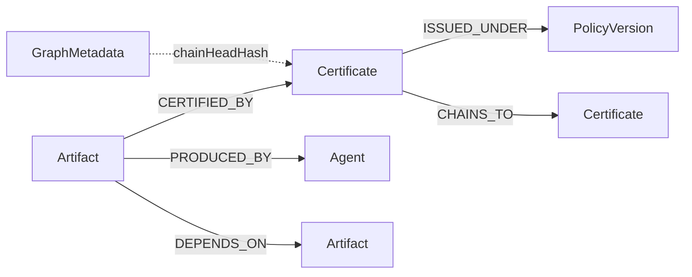

# Nexo Provenance Graph

Neo4j-backed, **read-only** certification provenance projection. Ed25519-signed, content-bound certificates remain the sole authority; the graph is a queryable index for lineage observability.

## Schema



| Node | Id | Properties |
|------|-----|------------|
| `Artifact` | content hash | `kind`: atom \| brick \| composition |
| `Certificate` | cert hash | `issuedAt`, `signerKeyId` |
| `PolicyVersion` | `name@version` | `name`, `version` |
| `Agent` | agent id | `kind`: human \| agent \| self |
| `GraphMetadata` | `provenance` | `chainHeadHash`, `projectedAt` |

Constraints are applied idempotently via `Neo4j/Neo4jSchemaMigration.cypher`.

## Trust and edge authority

The projector never accepts free-form relationship metadata. Optional graph claims are encoded under the `nexo.provenance.v1` certificate extension and therefore covered by the certificate's Ed25519 signature:

```json
{
  "artifactKind": "atom",
  "issuedAt": "2026-07-13T12:00:00+00:00",
  "policyName": "SelfProducedBrickCertificationPolicy",
  "policyVersion": "1.0.0",
  "producerAgentId": "nexo-demo-agent",
  "producerAgentKind": "self",
  "dependsOnArtifactIds": [],
  "priorCertificateHash": null
}
```

`CERTIFIED_BY` is derived from the verified certificate's `assetHash`. The other four relationship types are emitted only from these signed claims. Malformed claims, unsigned overlays, missing dependency targets, missing prior certificates, cycles, and multiple chain heads reject the entire batch before any write.

Projection is one transaction: verified nodes, relationships, and `GraphMetadata` commit together or roll back together. Queries obtain the current head through `IProvenanceChainHeadAuthority`, independently of graph metadata, and fail closed on mismatch.

## Local setup (one command)

```bash
bash scripts/demo-provenance-graph.sh
```

Or step by step:

```bash
# 1. Start Neo4j (publishes 7474/7687 on 127.0.0.1 only; NEO4J_AUTH is required -- no password ships in the compose file)
NEO4J_AUTH=neo4j/<password> docker compose -f deploy/compose/docker-compose.provenance.yml up -d

# 2. Project cert artifacts + run demo query (same password)
NEO4J_PASSWORD=<password> dotnet run --project tools/Nexo.Provenance.Demo/Nexo.Provenance.Demo.csproj
```

The one-command script derives `NEO4J_AUTH` from `NEO4J_USERNAME`/`NEO4J_PASSWORD` (demo defaults `neo4j`/`provenance-graph`); set them before running it to use different credentials.

## Demo queries

### `LineageOf(artifactId)`

Returns upstream certificate chain and `DEPENDS_ON` edges for an artifact. Results include the graph `chainHeadHash` for staleness detection.

Sample output:

```
Artifact:   8f168a714d1b9833b60055ba3d3b0da110198c5672a1ec73e4baf52c126a02e6
Chain head: f2d66709cdbdfcd67841996ca7c7b8cb8a37921819b261fed60cd15fe8c161cd
Certificates:
  - hash=f2d66709... policy=SelfProducedBrickCertificationPolicy@1.0.0
Dependencies: (none)
```

### `ArtifactsUnderPolicy(policyId, version)`

Variable-length traversal through `CHAINS_TO` / `ISSUED_UNDER` to find every artifact whose cert chain passes through the policy version.

Sample output:

```
=== ArtifactsUnderPolicy Demo ===
Policy:     SelfProducedBrickCertificationPolicy@1.0.0
Chain head: f2d66709cdbdfcd67841996ca7c7b8cb8a37921819b261fed60cd15fe8c161cd
Artifacts (1):
  - 8f168a714d1b9833b60055ba3d3b0da110198c5672a1ec73e4baf52c126a02e6
```

### `BlastRadiusOf(policyId, version)`

Downstream artifacts that would be affected if the policy version were revoked (transitive `DEPENDS_ON` from seeded artifacts).

## Tests

```bash
# Unit tests only (no Neo4j)
dotnet test applications/Nexo.Provenance.Graph.Tests/Nexo.Provenance.Graph.Tests.csproj --filter "Category!=Integration"

# Integration tests (Testcontainers Neo4j)
NEXO_RUN_NEO4J_CONTAINER=1 dotnet test applications/Nexo.Provenance.Graph.Tests/Nexo.Provenance.Graph.Tests.csproj --filter "Category=Integration"
```

Rejection tests (written first) verify:
- Invalid Ed25519 signatures are rejected and never projected
- Content-hash mismatches are rejected
- Unsigned relationship overlays and malformed signed claims are rejected
- Ambiguous chains and unknown relationship targets reject atomically
- Stale graph chain-head causes fail-closed query errors
- Round-trip: every edge is independently witness-derived from signed certificate bytes
- Idempotent projection (MERGE semantics)
- Neo4j batch rollback keeps graph metadata and nodes consistent

## DI registration

Neo4j is **optional**. Default registration uses null/no-op implementations:

```csharp
services.AddProvenanceGraph(); // no Neo4j

services.AddSingleton<IProvenanceSourceAdapter>(
    new PhysicalAtomDirectorySourceAdapter("cert-artifacts"));
services.AddSingleton<IProvenanceChainHeadAuthority, SourceProvenanceChainHeadAuthority>();

services.AddNeo4jProvenanceGraph(new Neo4jProvenanceGraphOptions
{
    Enabled = true,
    Uri = "bolt://localhost:7687",
    Username = "neo4j",
    Password = "provenance-graph"
});
```

No existing Nexo project takes a hard reference to Neo4j unless it explicitly opts in.
