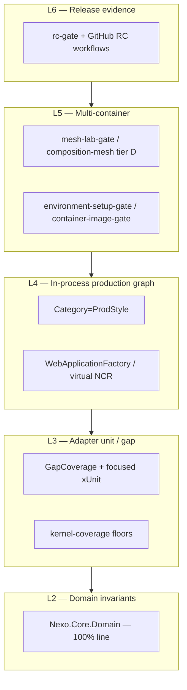

# Testing strategy pivot v1

**Status:** Adopted direction — execute phases in order.  
**Audience:** contributors, reviewers, release managers.  
**Related:** [Testing model](TestingModel.md) · [Coverage gates v1](../production-readiness/CoverageGates-v1.md) · [Testing guide](../Testing.md) · [Release candidate checklist v1](../ReleaseCandidateChecklist-v1.md)

---

## 1. Why pivot

The repo accumulated two overlapping goals:

1. **Line coverage** — especially `*GapCoverageTests` and Coverlet floors.
2. **Production fidelity** — ProdStyle, virtual API hosts, mesh lab, tiered `*-gate` targets.

Chasing **repo-wide 100% line coverage** fights (2): large surfaces (`ProviderFactory`, Docker/Postgres/Ollama/RunPod) are environment-bound and are already exercised by **tiered functional gates**, not unit tests.

**Target:** a **layered proof model** — strict where logic is pure, ratcheted where adapters are branchy, ProdStyle/mesh/RC where wiring and environment matter.



---

## 2. Principles (decision rules)

| # | Principle | Implication |
|---|-----------|-------------|
| P1 | **Domain is sacred** | `Nexo.Core.Domain` stays at **100% line** coverage; new domain types get tests in the same PR. |
| P2 | **Coverage floors ratchet, not chase** | Infrastructure (80% CI floor, enforced by scripts/ci/kernel-coverage-gate.sh) and Core.Application (~67%) use **minimum CI thresholds**; raise floors only when gap tests land in touched code. |
| P3 | **ProdStyle is the default for new kernel features** | New bricks, barriers, pipelines, routing, or `AddNexo` wiring → at least one **ProdStyle** or **WebApplicationFactory** test before merge. |
| P4 | **Environment code uses environment gates** | Docker, Postgres ephemeral, live Ollama/RunPod, Playwright → **mesh-lab**, **kernel-gate-tier-e**, **security-gate**, not Coverlet 100%. |
| P5 | **Gap tests are a scalpel** | Add `*GapCoverageTests` for small branchy adapters; do **not** add gap suites for megaclasses already covered by ProdStyle/virtual hosts. |
| P6 | **One scenario, one primary home** | Avoid duplicating the same assertion in gap + ProdStyle + bridge unless CLI parity (`UnitTestBase`) requires it. |
| P7 | **RC = workflows + evidence, not Coverlet** | Release readiness is `rc-gate`, release bundle JSON, security reports — see [Release candidate checklist v1](../ReleaseCandidateChecklist-v1.md). |

---

## 3. Current state (baseline)

| Area | Today | Pivot stance |
|------|--------|--------------|
| `Nexo.Core.Domain` | **100%** line (CI) | Keep |
| `Nexo.Infrastructure` | ~**83–84%** line (floor 80%), 1770+ xUnit tests | Floor + ProdStyle; no 100% goal |
| `Nexo.Core.Application` | ~**68%** line | Floor ratchet on change |
| `*GapCoverageTests` | Large volume (Transport, Orchestration, Infrastructure, …) | **Freeze scope**; grow only with touched files |
| ProdStyle | `make test-prod-style`, prime-time | **Mandatory** for routing/hosting/API PRs |
| Mesh / Docker | `mesh-lab-gate`, tier D gates | **Required** for mesh/fleet/deploy PRs |
| Coverage CI | `kernel-coverage` (Domain leg + floors) | **Required** branch checks |
| Contributor docs | Spread across `Testing.md`, `TestingModel.md` | **This doc** is the strategy; others stay operational |

---

## 4. Target contributor workflow

### Every PR (touching `src/` or `application/src/`)

```bash
# 1) Fast kernel contract slice (when kernel/hosting/pipeline)
make kernel-gate

# 2) Coverage regression guard
make kernel-coverage-gate

# 3) Production wiring (when DI, API, routing, barriers, Forge)
make test-prod-style
```

### PRs by blast radius

| Change type | Minimum proof |
|-------------|----------------|
| Domain types / invariants | Domain tests + `kernel-coverage` (Domain 100% leg) |
| Infrastructure adapter (small) | Gap or focused unit test + coverage floor |
| Infrastructure adapter (Docker/DB/cloud) | ProdStyle or virtual host + tier gate; **no** new 100% gap file |
| API / hosting | `application-gate-tier-c` or ProdStyle WAF tests |
| Mesh / fleet / trust | `composition-mesh-gate` + path-filtered CI |
| CLI-only | `application-gate-tier-a/b`, `Nexo.Tests.CLI` |

### Before release tag

```bash
NEXO_READY_SKIP_DOCKER=1 make nexo-ready-gate   # or full with Docker
make rc-gate-full
# + GitHub workflows in ReleaseCandidateChecklist-v1.md
```

---

## 5. Execution phases

Phases are **ordered by dependency**. Complete phase N sign-off in [Testing strategy tracking](TestingStrategyTracking-v1.md) before treating N+1 as done.

### Phase 0 — Align documentation (low risk)

**Goal:** Single strategy narrative; no CI behavior change.

| # | Task | Owner | Done when |
|---|------|-------|-----------|
| 0.1 | Publish this doc; link from `Testing.md`, `TestingModel.md`, `CoverageGates-v1.md`, `production-readiness/README.md` | Docs | Links merged |
| 0.2 | Add **PR template** testing section (blast-radius table §4) | Docs | `.github/PULL_REQUEST_TEMPLATE.md` updated |
| 0.3 | Add `docs/architecture/TestingStrategyTracking-v1.md` checklist | Docs | Tracking file exists |

### Phase 1 — Lock coverage policy (mostly done)

**Goal:** CI enforces floors; domain at 100%; no repo-wide 100% goal stated anywhere.

| # | Task | Done when |
|---|------|-----------|
| 1.1 | `kernel-coverage-gate.yml` + `scripts/ci/kernel-coverage-gate.sh` | Green on `master` |
| 1.2 | Domain threshold **100%** (`core-domain-coverage`, folded into `kernel-coverage-gate` 2026-08-16) | Green |
| 1.3 | Document exclusions (Docker/Postgres/Ollama) in [Coverage gates v1](../production-readiness/CoverageGates-v1.md) | Doc merged |
| 1.4 | Branch protection: require `kernel-coverage` | GitHub settings |
| 1.5 | Remove or rewrite any internal docs that imply **global 100% line** is the goal | Audit complete |

### Phase 2 — ProdStyle-first for new code

**Goal:** New features default to production wiring tests.

| # | Task | Done when |
|---|------|-----------|
| 2.1 | **CONTRIBUTING.md** — “new kernel feature → ProdStyle test” rule | Merged |
| 2.2 | PR label or checklist: `needs-prod-style` when paths match `Nexo.Hosting`, `Nexo.API`, `Execution/Routing`, barriers | Process live |
| 2.3 | `make test-prod-style` in `application-gate-tier-a` or `kernel-gate-tier-c` (already partially true) — document as **required local** for those paths | Doc + optional CI path filter job |
| 2.4 | Audit new PRs for **gap-only** changes to megaclasses; request ProdStyle instead in review guide | Review norm |

### Phase 3 — CI path filters and required checks map

**Goal:** PRs run the **right tier**, not only full Infrastructure `dotnet test`.

| # | Task | Done when |
|---|------|-----------|
| 3.1 | Table in tracking doc: **path → required workflows** (kernel-gate, mesh-lab, security-gate, distribution-matrix, …) | Table published |
| 3.2 | Ensure path-filtered workflows cover mesh, ingress, game-director, application | CI audit |
| 3.3 | Optional: `testing-strategy-gate.yml` — smoke job that fails if ProdStyle filter is empty on hosting PRs (lint PR paths) | Job exists or waived with rationale |
| 3.4 | Document required GitHub checks for RC in [Testing and quality gates](../production-readiness/TestingAndQualityGates.md) | Checklist updated |

### Phase 4 — Gap test hygiene (incremental)

**Goal:** Stop unbounded gap growth; improve signal-to-noise.

| # | Task | Done when |
|---|------|-----------|
| 4.1 | **Freeze list:** no new `*GapCoverageTests` files without justification in PR description | Team agreement |
| 4.2 | **Allow list for megaclasses** (extend tests in existing files only): `ProviderFactory`, `DockerService`, `PostgresDatabaseProvisioner`, `BehaviorExecutor`, … | List in tracking doc |
| 4.3 | When editing an allow-listed file, prefer **one ProdStyle test** over **50 gap lines** | Review norm |
| 4.4 | Optional tooling: script reporting Coverlet **uncovered lines in changed files only** (PR comment) | Script in `scripts/ci/` or backlog |
| 4.5 | Ratchet `INFRA_COVERAGE_THRESHOLD` / `APP_COVERAGE_THRESHOLD` by **+0.5–1%** per quarter if gaps land | Scheduled in tracking |

### Phase 5 — RC and evidence linkage

**Goal:** Release managers use gates consistently.

| # | Task | Done when |
|---|------|-----------|
| 5.1 | Map [Release candidate checklist v1](../ReleaseCandidateChecklist-v1.md) §1 to Makefile + workflow names | Table in tracking doc |
| 5.2 | `make rc-gate-full` documented as **pre-tag** command in [RC Readiness](../production-readiness/RCReadiness-v1.md) | Doc merged |
| 5.3 | Release bundle (`ci release-bundle`) artifact checked in `rc-gate-tier-c` | Already exists — verify green monthly |
| 5.4 | Separate **“testing strategy complete”** from **“RC signed”** in sign-off docs | No ambiguity |

---

## 6. CI / Makefile target map (target state)

| Layer | Local command | CI workflow (examples) | Required on `master` |
|-------|---------------|------------------------|----------------------|
| L2 Domain | `kernel-coverage-gate` (domain leg) | `kernel-coverage-gate.yml` | **Yes** (`kernel-coverage`) |
| L3 Ratchet | `kernel-coverage-gate` (full) | `kernel-coverage-gate.yml` | **Yes** (`kernel-coverage`) |
| L4 ProdStyle | `make test-prod-style` | `kernel-gate-tier-c`, prime-time, `ci verify` | Path-dependent |
| L4 Application | `make application-gate-tier-c` | application workflows | Path-dependent |
| L5 Mesh | `make mesh-lab-e2e` | `mesh-lab-gate.yml` | Mesh/fleet paths |
| L6 RC | `make rc-gate-full` | `production-readiness-gate-v1`, `runtime-release-gate`, … | Release branch / manual |

---

## 7. Metrics (how we know the pivot worked)

| Metric | Target | Anti-metric |
|--------|--------|-------------|
| Domain line coverage | **100%** (held) | — |
| Infrastructure line coverage | **Stable floor**, slow ratchet | Chasing 100% |
| New kernel features without ProdStyle | **→ 0** | Gap-only PRs for wiring |
| `*GapCoverageTests` file count | **Flat or slow growth** | New gap files per week |
| RC failures from “missing unit test” | **↓** | RC blocked only by Coverlet |
| RC failures from mesh/compose/bundle | **Visible early** | Surprises on tag day |
| CI time on docs-only PRs | Unchanged | Running full Infra suite on markdown |

---

## 8. Anti-patterns (stop doing)

- Adding a 500-line `ProviderFactoryGapCoverageTests.cs` instead of one virtual NCR / mock-provider ProdStyle test.
- Lowering `INFRA_COVERAGE_THRESHOLD` to greenwash CI.
- Duplicating the same scenario in gap + ProdStyle + `UnitTestBridgeTests` without reason.
- Skipping `make test-prod-style` because `dotnet test` Infrastructure passed.
- Treating **Coverlet green** as **release ready** without `rc-gate` evidence.

---

## 9. Out of scope (explicit)

- Replacing xUnit with another runner.
- Removing `UnitTestBase` / CLI test bridge (still needed for `nexo test`).
- Deleting existing gap tests en masse (only **freeze + redirect** new work).
- 100% branch coverage repo-wide.

---

## 10. Execution status

Pivot automation is **in repo** (see [Testing strategy tracking v1](TestingStrategyTracking-v1.md)):

- `testing-strategy-gate.yml` + `scripts/ci/pr-testing-strategy-gate.sh` · `make testing-strategy-gate`
- `kernel-coverage-gate.yml` + `make kernel-coverage-gate` (domain 100%, infra/app floors)
- [Testing review guide v1](TestingReviewGuide-v1.md)
- Test-reduction hygiene: merged duplicate `*GapCoverageTests` pairs; `WorkflowExecutorEdgeCaseTests` replaces the gap megaclass

**Manual (org):** enable branch protection checks per `docs/GitHubBranchProtection.md`.
