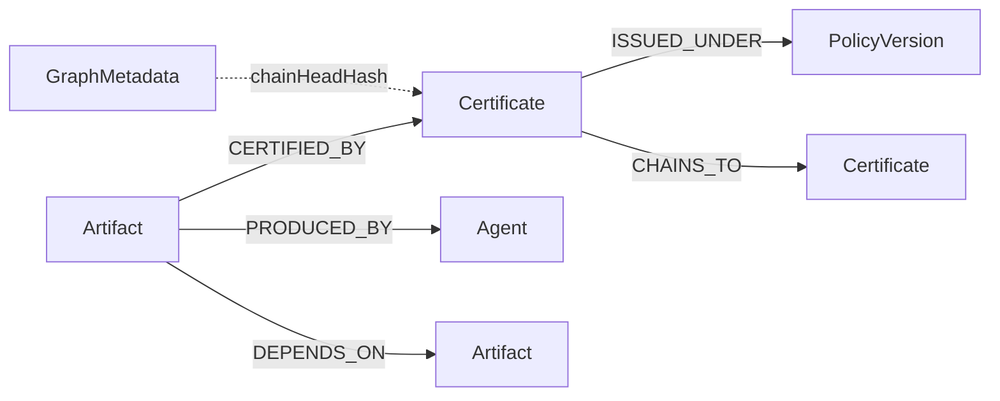

# Nexo Provenance Graph

Neo4j-backed, **read-only** certification provenance projection. Ed25519-signed, content-bound certificates remain the sole authority; the graph is a queryable index for lineage observability.

## Schema



| Node | Id | Properties |
|------|-----|------------|
| `Artifact` | content hash | `kind`: atom \| brick \| composition |
| `Certificate` | cert hash | `issuedAt`, `signerKeyId` |
| `PolicyVersion` | `name@version` | `name`, `version` |
| `Agent` | agent id | `kind`: human \| agent \| self |
| `GraphMetadata` | `provenance` | `chainHeadHash`, `projectedAt` |

Constraints are applied idempotently via `Neo4j/Neo4jSchemaMigration.cypher`.

## Local setup (one command)

```bash
bash scripts/demo-provenance-graph.sh
```

Or step by step:

```bash
# 1. Start Neo4j
docker compose -f docker-compose.provenance.yml up -d

# 2. Project cert artifacts + run demo query
dotnet run --project tools/Nexo.Provenance.Demo/Nexo.Provenance.Demo.csproj
```

## Demo queries

### `LineageOf(artifactId)`

Returns upstream certificate chain and `DEPENDS_ON` edges for an artifact. Results include the graph `chainHeadHash` for staleness detection.

Sample output:

```
Artifact:   18301e3630ca2816dcb1e23264aaec41d9ed4108337c9b5a936e39565d01c742
Chain head: a3f2... (terminal cert hash)
Certificates:
  - hash=7b1c... policy=SelfProducedBrickCertificationPolicy@1.0.0
Dependencies: (none)
```

### `ArtifactsUnderPolicy(policyId, version)`

Variable-length traversal through `CHAINS_TO` / `ISSUED_UNDER` to find every artifact whose cert chain passes through the policy version.

Sample output:

```
=== ArtifactsUnderPolicy Demo ===
Policy:     SelfProducedBrickCertificationPolicy@1.0.0
Chain head: a3f2c8e1...
Artifacts (1):
  - 18301e3630ca2816dcb1e23264aaec41d9ed4108337c9b5a936e39565d01c742
```

### `BlastRadiusOf(policyId, version)`

Downstream artifacts that would be affected if the policy version were revoked (transitive `DEPENDS_ON` from seeded artifacts).

## Tests

```bash
# Unit tests only (no Neo4j)
dotnet test src/Nexo.Provenance.Graph.Tests/Nexo.Provenance.Graph.Tests.csproj --filter "Category!=Integration"

# Integration tests (Testcontainers Neo4j)
NEXO_RUN_NEO4J_CONTAINER=1 dotnet test src/Nexo.Provenance.Graph.Tests/Nexo.Provenance.Graph.Tests.csproj --filter "Category=Integration"
```

Rejection tests (written first) verify:
- Invalid Ed25519 signatures are rejected and never projected
- Content-hash mismatches are rejected
- Stale graph chain-head causes fail-closed query errors
- Round-trip: every edge is witness-derivable from cert payloads
- Idempotent projection (MERGE semantics)

## DI registration

Neo4j is **optional**. Default registration uses null/no-op implementations:

```csharp
services.AddProvenanceGraph(); // no Neo4j

services.AddNeo4jProvenanceGraph(new Neo4jProvenanceGraphOptions
{
    Enabled = true,
    Uri = "bolt://localhost:7687",
    Username = "neo4j",
    Password = "provenance-graph"
});
```

No existing Nexo project takes a hard reference to Neo4j unless it explicitly opts in.
